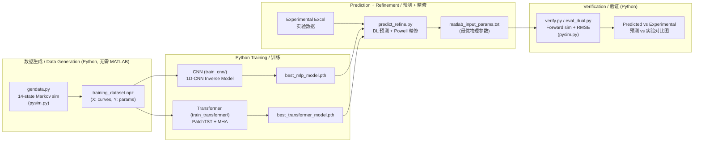

# DNA Nanorobot Inverse Design & Verification System

# DNA 纳米机器人逆向设计与验证系统

> **Inverse design of physical parameters for a light-controlled DNA Walker nanorobot using deep learning.**
>
> **利用深度学习反推光控 DNA Walker 纳米机器人物理参数。**

---

## Results / 结果

### 模型选择结论 / Model selection (1000-sample held-out test set)

在 1000 个留出测试样本上评估"预测质量"（每个样本：预测参数 → 正向模拟 →
与该样本真实曲线比 RMSE）。**CNN 在所有统计指标上均优于 Transformer。**

| 指标 / Metric (纯 DL, 不含精修) | CNN | Transformer |
|--------------------------------|-----|-------------|
| 曲线重构 RMSE 均值 / mean | **0.0188** | 0.0465 |
| 曲线重构 RMSE 中位数 / median | **0.0096** | 0.0153 |
| 曲线重构 RMSE P90 | **0.0471** | 0.1165 |
| 有效样本率 / valid rate | **99.9%** | 96.8% |
| 参数 MSE (scaled) | **0.0235** | 0.0333 |

> **生产推荐：CNN。** 预测更准、更稳定、灾难性失败率低 32 倍 (1 vs 32 个样本)。
> 复现：`cd train_cnn && python eval_testset.py`

### 实验曲线拟合 / Experimental curve fitting (原始 + 泛化)

DL 预测后再用 `pysim` 正向模拟做**物理精修** (Powell + 多起点)，直接最小化曲线 RMSE：

| 数据集 / Dataset | CNN 精修后 | Transformer 精修后 | 论文参考 / Paper ref |
|-----------------|-----------|-------------------|---------------------|
| original | **0.0078** | 0.0080 | 0.0089 |
| generalization | **0.0161** | 0.0170 | 0.0338 (baseline m03) |

> **关键结论：这是病态逆问题** —— 参数空间 MSE 小 ≠ 曲线 RMSE 小。
> 精修是模型无关的曲线拟合，会把两个模型拉到同一物理下界 (~0.008/0.016)，
> 故**模型优劣应看精修前的纯 DL 指标**（见上表），精修仅用于交付最优物理参数。
> 精修后两模型均优于论文参考拟合。

```bash
# 生产预测 + 精修 (CNN 为推荐模型)
cd train_cnn && python predict_refine.py --ensemble 20
# 测试集模型评估 / 双数据集评估
python eval_testset.py          # 1000 样本预测质量
python eval_dual.py --ensemble 20   # 原始+泛化拟合 + 出图
```

---

## Table of Contents / 目录

- [Introduction / 简介](#introduction--简介)
- [System Architecture / 系统架构](#system-architecture--系统架构)
- [Directory Structure / 目录结构](#directory-structure--目录结构)
- [Predicted Parameters / 预测参数说明](#predicted-parameters--预测参数说明)
- [End-to-End Workflow / 端到端工作流](#end-to-end-workflow--端到端工作流)
  - [Step 1: Data Generation / 数据生成](#step-1-data-generation--数据生成)
  - [Step 2: CNN Training / CNN 训练](#step-2-cnn-training--cnn-训练)
  - [Step 3: Transformer Training / Transformer 训练](#step-3-transformer-training--transformer-训练)
  - [Step 4: Prediction / 预测](#step-4-prediction--预测)
  - [Step 5: Verification / 验证](#step-5-verification--验证)
- [Smoke Test / 冒烟测试](#smoke-test--冒烟测试)
- [Setup / 环境配置](#setup--环境配置)
- [Configuration / 配置文件说明](#configuration--配置文件说明)
- [HPC Guide / HPC 使用指南](#hpc-guide--hpc-使用指南)
- [Ablation: Why CNN Wins / 消融实验](#ablation-why-cnn-wins--消融实验cnn-为何更好)

---

## Introduction / 简介

This project builds the complete machine learning pipeline for inverse design of a
**light-controlled DNA Walker nanorobot**. Given three fluorescence intensity curves
(FAM, TYE, CY5) measured experimentally, the system predicts 7 physical parameters
that govern the walker's behavior using a 14-state Markov transition model.

本项目构建了**光控 DNA Walker 纳米机器人**逆向设计的完整机器学习流程。
给定三条实验荧光曲线（FAM、TYE、CY5），系统基于 14 态马尔可夫跳转模型
预测控制 Walker 行为的 7 个物理参数。

Two parallel model architectures are provided (各自隔离在独立文件夹):
| Model | Architecture | Input Shape | Note |
|-------|-------------|-------------|------|
| **CNN (MLP)** | 1D-Conv → FC → Sigmoid | `(N, 23403)` flattened | **预测最准 / best predictor** (见 Results) |
| **Transformer** | PatchTST + MHA → Sigmoid | `(N, 3, 7801)` 3D | 全局感受野 + 显式跨通道注意力 |

两个模型在 1000 样本测试集上对比，CNN 预测质量更高 (见 [Results](#results--结果))。
所有预测均可接 `pysim` 物理精修以获得最优曲线拟合。

---

## System Architecture / 系统架构



> 全流程已纯 Python 化，**不再依赖 MATLAB**。原 MATLAB 脚本 (`gendata.m`/`verify.m`)
> 作为 legacy 保留。物理模型逐位对齐，详见 [Python-only Workflow](#python-only-workflow--纯-python-工作流-无需-matlab)。

---

## Directory Structure / 目录结构

```
MachineLearning_for_DNAwalker/
│
├── configfile.ini              # 全局配置 / Global config (physics, training, data)
├── configfile.smoke.ini        # 冒烟测试配置覆盖 / Smoke test config override
├── config_loader.py            # 统一配置管理类 / Unified config manager
├── README.md                   # 本文件 / This file
├── requirements.txt            # Python 依赖 / Python dependencies
├── .gitignore                  # Git 忽略规则 / Git ignore rules
│
│  ── 共享物理内核 (Python 移植，无需 MATLAB) / Shared physics core ──
├── pysim.py                    # 14 态马尔可夫正向模拟器 (gendata.m 移植，加速 35×)
├── gendata.py                  # 训练数据生成 (gendata.m / gendata_smoke.m 移植)
├── verify.py                   # 正向验证 + RMSE + 对比图 (verify.m 移植)
├── refine.py                   # 物理参数局部精修 (直接最小化曲线 RMSE)
├── exp_data_io.py              # 实验 Excel 健壮读取 / Robust experimental Excel loader
├── run_smoke_test.sh           # 端到端冒烟测试 (Mac/Linux, 纯 Python)
│
├── train_cnn/                  # ===== CNN (MLP) 模型 (自包含, 推荐模型) =====
│   ├── model_cnn.py            #   InverseCNN 模型定义 / Model definition
│   ├── data_loader.py          #   数据加载与预处理 / Data loading & preprocessing
│   ├── train_mlp.py            #   主训练脚本 / Main training script
│   ├── inference_cnn.py        #   推理模块 / Inference module
│   ├── predict.py              #   纯 DL 预测 / DL-only prediction
│   ├── predict_refine.py       #   预测 + 物理精修 (标准) / Predict + refinement
│   ├── eval_dual.py            #   双数据集评估 + 精修 + 出图 / Dual-dataset eval
│   ├── eval_testset.py         #   1000 样本测试集预测质量 / Test-set quality
│   ├── verify.m / optimize_params.m  # 旧版 MATLAB (legacy)
│   ├── run_job.sh              #   HPC PBS 作业脚本 / HPC PBS job script
│   └── results/                #   模型输出 / Model outputs (gitignored)
│
├── train_transformer/          # ===== Transformer 模型 (自包含) =====
│   ├── config_transformer.ini  #   标准超参数 (patch=100) / Standard hyperparams
│   ├── config_transformer.smoke.ini  # 冒烟覆盖 / Smoke override
│   ├── config_loader_transformer.py  # 配置加载器 / Config loader
│   ├── model_transformer.py    #   PatchTST + MHA 模型 / Model definition
│   ├── dataset.py              #   3D 数据加载 / 3D data loading
│   ├── train_transformer.py    #   主训练脚本 / Main training script
│   ├── inference_transformer.py #  推理模块 / Inference module
│   ├── predict.py              #   纯 DL 预测 (legacy) / DL-only prediction
│   ├── predict_refine.py       #   预测 + 物理精修 (标准) / Predict + refinement
│   ├── evaluate_rmse.py        #   单数据集真实指标评估 / Real-metric eval
│   ├── eval_dual.py            #   双数据集评估 + 精修 + 出图 / Dual-dataset eval
│   ├── eval_testset.py         #   1000 样本测试集预测质量 / Test-set quality
│   ├── verify.m / optimize_params.m  # 旧版 MATLAB (legacy)
│   ├── run_job.sh              #   HPC PBS 作业脚本 / HPC PBS job script
│   └── results/                #   模型输出 / Model outputs (gitignored)
│
├── utils/                      # ===== 工具脚本 / Utility Scripts =====
│   ├── check_npz.py            #   NPZ 数据集检查 / NPZ dataset inspector
│   ├── mat_to_npz.py           #   MATLAB→NPZ 转换 / MATLAB to NPZ converter
│   └── stretch_data.py         #   实验数据振幅拉伸 / Experimental data stretching
│
├── gendata.m / gendata_smoke.m # 旧版 MATLAB 数据生成 (legacy)
├── run_smoke_test.ps1          # 旧版冒烟测试 (需 MATLAB, legacy)
└── results/                    # 共用数据集 / Shared datasets (gitignored)
    ├── training_dataset.npz    #   训练数据 / Training data
    └── *.xlsx                  #   实验数据 / Experimental data
```

> **隔离性 / Isolation:** `train_cnn/` 与 `train_transformer/` 互不导入，各自自包含。
> 两者仅共享根目录的物理内核 (`pysim`/`refine`/`exp_data_io`/`config_loader`)。
> 每个方法在自己文件夹内独立训练、预测、评估、出图。

---

## Predicted Parameters / 预测参数说明

| Parameter | Physical Meaning / 物理含义 | Unit / 单位 | Log Transform |
|-----------|---------------------------|-------------|---------------|
| `E_b` | Base binding energy / 基础结合能 | eV | No |
| `E_b_azo_trans` | Trans-azobenzene binding energy / 反式偶氮苯结合能 | eV | No |
| `E_b_azo_cis` | Cis-azobenzene binding energy / 顺式偶氮苯结合能 | eV | No |
| `k_mig` | Leg migration rate / 腿迁移速率 | s⁻¹ | No |
| `k0` | Intrinsic unbinding rate / 固有解绑速率 | s⁻¹ | ✅ `log10` |
| `drt_z` | Z-track duty ratio / Z 轨道占空比 | — | No |
| `drt_s` | S-track duty ratio / S 轨道占空比 | — | No |

---

## End-to-End Workflow / 端到端工作流

### Step 1: Data Generation / 数据生成

**标准流程 (Python，无需 MATLAB) / Standard: Python data generation**

```bash
python gendata.py                 # 正式: 30000 样本 (5 箱均衡采样)
python gendata.py --smoke         # 冒烟: 20 样本
python gendata.py --target 10000 --workers 12   # 自定义数量/并行数
```

`gendata.py` 用 `pysim.py` (14 态马尔可夫正向模拟，逐位对齐 `gendata.m`) 多进程并行生成，
按信号活跃度分箱做不平衡采样，输出 `results/training_dataset.npz`，键为 `X(N,3,7801)` / `Y(N,7)`。

**旧流程 (需 MATLAB) / Legacy MATLAB:**

```matlab
gendata   % 生成 training_dataset.mat
```
```bash
cd utils/ && python mat_to_npz.py ../path/to/training_dataset.mat   # 转 NPZ
```

**Output / 输出:** `results/training_dataset.npz` — `X(N, 3, 7801)` 曲线, `Y(N, 7)` 参数。

---

### Step 2: CNN Training / CNN 训练 (推荐模型 / recommended)

```bash
cd train_cnn/
python train_mlp.py                          # 正式训练 / Full training
python train_mlp.py --config ../configfile.smoke.ini   # 冒烟 / Smoke
```

- 自适应加权 MSE 损失 + ReduceLROnPlateau 调度；Adam 优化器。
- MPS (Apple Silicon) 上约 2s/epoch，早停后约 500 epoch 收敛。
- **Output / 输出:** `results/best_mlp_model.pth`, `results/y_scaler.pkl`

---

### Step 3: Transformer Training / Transformer 训练

```bash
cd train_transformer/
python train_transformer.py                  # 正式训练 (标准 patch=100, 300 epoch)
python train_transformer.py --config ../configfile.smoke.ini \
    --transformer-config config_transformer.smoke.ini --smoke   # 冒烟
```

- AdamW 优化器 + Cosine Warmup 调度；PatchTST + 多头注意力。
- 标准配置 patch=100/stride=100，MPS 上约 23s/epoch (旧 patch=50 为 ~120s，提速 5.6×)。
- **Output / 输出:** `results/best_transformer_model.pth`, `results/transformer_y_scaler.pkl`

---

### Step 4: Prediction / 预测

**标准流程：预测 + 物理精修 / Standard: prediction + refinement**

```bash
# CNN (推荐模型) / recommended
cd train_cnn/
python predict_refine.py --ensemble 20

# Transformer (对称流程) / symmetric
cd train_transformer/
python predict_refine.py --ensemble 20
```

Pipeline: Load Excel → Interpolation → SG Smoothing → DL Prediction (Test-Time Ensemble)
→ **Physics Refinement (Powell, multi-start)** → `matlab_input_params.txt`

流程：加载 Excel → 插值 → SG 平滑 → DL 预测（测试时集成）
→ **物理精修（Powell 局部优化 + 多起点，直接最小化曲线 RMSE）** → `matlab_input_params.txt`

> 这是逆问题，参数 MSE 小 ≠ 曲线拟合好。物理精修是把最终曲线拟合做到最好的关键
> (实测 RMSE 相比纯 DL 降低 54–89%)。**注意：精修是模型无关的，比较模型优劣请用
> 纯 DL 指标 (`eval_testset.py`)，不要用精修后数字。**

**纯 DL 预测 (不含精修) / DL-only:**

```bash
cd train_cnn/ && python predict.py            # CNN
cd train_transformer/ && python predict.py    # Transformer
```

> ⚠️ `predict.py` 与 `predict_refine.py` 写入同一个 `matlab_input_params.txt`，
> 后运行者覆盖前者。生产请用 `predict_refine.py`。

---

### Step 5: Verification & Evaluation / 验证与评估

**标准流程 (纯 Python，无需 MATLAB) / Standard: Python evaluation**

```bash
# 1) 正向模拟单组参数 + RMSE + 对比图
python verify.py train_cnn/matlab_input_params.txt --out train_cnn/results/verify.png

# 2) 双数据集拟合评估 (原始 + 泛化, 含精修, 自动出图) —— 每个文件夹各自跑
cd train_cnn/ && python eval_dual.py --ensemble 20            # CNN
cd train_transformer/ && python eval_dual.py --ensemble 20    # Transformer

# 3) 1000 样本测试集预测质量 (模型选择依据, 不含精修) —— 每个文件夹各自跑
cd train_cnn/ && python eval_testset.py                       # CNN
cd train_transformer/ && python eval_testset.py               # Transformer
```

- `verify.py`：根目录共享工具，对任意 `matlab_input_params.txt` 正向模拟并算逐通道 RMSE。
- `eval_dual.py`：在原始/泛化两条实验曲线上评估，输出 `dual_fit.<tag>.png` + `rmse_dual.<tag>.json`。
- `eval_testset.py`：在 1000 留出样本上评估预测质量，输出 `testset_eval.<tag>.json` —— **模型对比看这个**。

**旧流程 (需 MATLAB) / Legacy MATLAB:**

```matlab
cd train_cnn        % or cd train_transformer
verify              % Reads matlab_input_params.txt, runs forward ODE, plots comparison
```

---

## Smoke Test / 冒烟测试

We provide an automated smoke test script to quickly verify that the entire pipeline (data generation, format conversion, CNN training, and Transformer training) is functioning correctly without waiting for a full dataset generation or training process.

我们提供了一个自动化的冒烟测试脚本，可以快速验证整个工作流（数据生成、格式转换、CNN 训练和 Transformer 训练）是否正常运行，这就无需漫长地等待完整的数据集生成或模型训练过程。

```bash
# 纯 Python 端到端冒烟测试 (Mac/Linux，无需 MATLAB)
./run_smoke_test.sh
```

```powershell
# 旧版 (需 MATLAB) / Legacy (requires MATLAB)
.\run_smoke_test.ps1
```

**`run_smoke_test.sh` 执行的步骤 (纯 Python) / Steps (pure Python):**
1. **数据生成 / Data Generation:** `gendata.py --smoke` 快速生成 20 样本小数据集 (`results/training_dataset_smoke.npz`)。
2. **CNN 冒烟训练 / CNN smoke:** `train_mlp.py --config configfile.smoke.ini` 训练 2 epoch 验证流程。
3. **Transformer 冒烟训练 / Transformer smoke:** `train_transformer.py --smoke` + smoke 配置覆盖，训练数 epoch。
4. **预测 + 验证 / Predict & Verify:** `predict.py` 出参数，`verify.py` 正向模拟算 RMSE。

强烈建议在修改核心模块后运行此冒烟测试，以确保没有引入会破坏流水线逻辑的错误。

> 旧版 `run_smoke_test.ps1` (PowerShell + MATLAB) 作为 legacy 保留，需自备 MATLAB。

---

## Setup / 环境配置

### macOS / Linux (本仓库已在 Apple Silicon + Python 3.12 验证)

本项目已**完全移植为纯 Python 工作流**，数据生成与正向验证不再依赖 MATLAB。
推荐用 [uv](https://github.com/astral-sh/uv) 管理 Python 与依赖：

```bash
# 安装 uv (无需 sudo)
curl -LsSf https://astral.sh/uv/install.sh | sh

# 创建 Python 3.12 虚拟环境并安装依赖
uv venv --python 3.12 .venv
uv pip install -r requirements.txt --python .venv/bin/python

# 之后激活环境
source .venv/bin/activate
```

> 说明：`requirements.txt` 中的 `pandas>=3.0.1` 要求 Python ≥ 3.11，故使用 3.12
> 而非 README 早期写的 3.10。PyTorch 在 Apple Silicon 上自动使用 **MPS** 加速，
> 无需 CUDA。

### Conda (原始方式，需自备 MATLAB 做数据生成/验证)

```powershell
conda create -n dna_env python=3.10
conda activate dna_env
pip install torch torchvision --index-url https://download.pytorch.org/whl/cu124
pip install -r requirements.txt
```

**Key dependencies / 关键依赖:** `torch`, `numpy`, `scipy`, `scikit-learn`, `pandas`, `openpyxl`, `h5py`

---

## Python-only Workflow / 纯 Python 工作流 (无需 MATLAB)

以下脚本为 MATLAB 脚本的 Python 移植，物理模型逐位对齐 `gendata.m`：

| Python 脚本 | 替代的 MATLAB | 作用 |
|-------------|--------------|------|
| `pysim.py` | `run_dna_motor_simulation` (gendata.m) | 14 态马尔可夫正向模拟内核 |
| `gendata.py` | `gendata.m` / `gendata_smoke.m` | 生成训练数据集 `.npz` |
| `verify.py` | `verify.m` | 正向验证 + RMSE + 对比图 |
| `run_smoke_test.sh` | `run_smoke_test.ps1` | 端到端冒烟测试 |

```bash
# 生成数据 (正式 30000 样本 / 冒烟 20 样本)
python gendata.py                 # 正式
python gendata.py --smoke         # 冒烟

# 预测后做正向验证 (输出 RMSE + png 对比图)
python verify.py train_transformer/matlab_input_params.txt

# 一键端到端冒烟测试
./run_smoke_test.sh
```

---

## Configuration / 配置文件说明

### `configfile.ini` (Root / 根目录)

Global configuration shared by both CNN and Transformer:

CNN 和 Transformer 共用的全局配置：

| Section | Contents / 内容 |
|---------|----------------|
| `[TRAINING]` | Learning rate, batch size, epochs, scheduler, dataset split / 学习率、批次、轮数等 |
| `[MODEL_ARCHITECTURE]` | CNN Conv/FC layer params / CNN 卷积/全连接层参数 |
| `[DATA_PROCESSING]` | Log transform, NaN cleanup, amplitude filter / 对数变换、数据清洗 |
| `[DATA_GENERATION]` | Output filename / 输出文件名 |
| `[PHYSICAL_PARAMETERS]` | Fixed/trainable params / 固定/可训练参数 |
| `[TRAINING_PARAMETER_RANGES]` | Min-max ranges / 参数范围 |
| `[NANOROBOT_MODELING]` | Experimental data path, simulation time / 实验数据路径、仿真时间 |
| `[PREDICTION]` | SG smoothing, Test-Time Ensemble / SG 平滑、集成预测 |

### `config_transformer.ini` (train_transformer/)

Transformer-specific hyperparameters:

| Section | Contents / 内容 |
|---------|----------------|
| `[TRANSFORMER]` | d_model, n_heads, n_layers, patch_size, dropout, optimizer / 模型结构、优化器 |
| `[PATHS]` | Dataset file path / 数据集路径 |

---

## HPC Guide / HPC 使用指南

All training scripts include PBS job scripts for HPC clusters:

所有训练脚本都包含 PBS 作业脚本：

```powershell
# CNN training on HPC / HPC 上训练 CNN
cd train_cnn/
qsub run_job.sh

# Transformer training on HPC / HPC 上训练 Transformer
cd train_transformer/
qsub run_job.sh
```

---

## Model Architecture Comparison / 模型架构对比

|  | CNN (`train_cnn/`) | Transformer (`train_transformer/`) |
|--|---|---|
| **Input / 输入** | `(N, 23403)` flattened / 展平 | `(N, 3, 7801)` 3D |
| **Long-range / 长程依赖** | ❌ Local receptive field / 局部感受野 | ✅ Global via Multi-Head Attention / 全局 |
| **Channel relation / 通道关系** | Implicit fusion / 隐式融合 | Explicit Cross-Channel Attention / 显式 |
| **Optimizer / 优化器** | Adam | AdamW |
| **LR Schedule / 学习率调度** | ReduceLROnPlateau | Cosine Warmup (patch=100) |
| **Parameters / 参数量** | 4.38M (实测 / measured) | 3.24M (实测, patch=100) |
| **测试集预测质量 / Test-set quality** | **均值 0.0188, 失败 0.1%** | 均值 0.0465, 失败 3.2% |

> **实测结论 (1000 样本)：CNN 预测更准、更稳健。** 见 [Results](#results--结果)。
> 架构直觉 ("Transformer 更强") 被数据推翻 —— 对这类平滑、低频、局部的信号，
> 全局注意力没有用武之地 (见下方消融实验)。

---

## Ablation: Why CNN Wins / 消融实验：CNN 为何更好

为排除"CNN 赢只是因为参数量大 35%"这一混淆变量，做了**双向容量对照**消融
(1000 样本测试集，曲线重构 RMSE)：

| 模型 / Model | 参数量 | RMSE 均值 | RMSE 中位 | P90 | 有效率 |
|-------------|-------|----------|----------|-----|-------|
| CNN 标准 / standard | 4.38M | **0.0188** | 0.0096 | 0.0471 | 99.9% |
| **CNN 缩小 / shrunk** | **3.27M** | **0.0190** | 0.0102 | 0.0473 | 99.9% |
| Transformer 标准 / standard | 3.24M | 0.0465 | 0.0153 | 0.1165 | 96.8% |
| **Transformer 放大 / enlarged** | **4.30M** | **0.0476** | 0.0158 | 0.1310 | 99.4% |

- **A. 把 CNN 缩到 Transformer 容量 (4.38M→3.27M):** RMSE 0.0188→0.0190，几乎不变，依然碾压。
  → CNN 赢**不是**因为容量大。
- **B. 把 Transformer 放大到 CNN 容量 (3.24M→4.30M, 4→6 层):** RMSE 0.0465→0.0476，没有变好。
  → Transformer 输**不是**因为容量小 (加深反而略差，深栈在 8000 样本上更难优化)。

**等容量下，更小的 CNN (3.27M) 仍把 RMSE 做到 Transformer (4.30M) 的 ~40%。**

### 根本原因 (数据支撑) / Root cause (data-backed)

任务信息是**局部 + 平滑 + 低频**的，匹配 CNN 的卷积归纳偏置：

1. **频谱:** 三通道曲线 95% 能量集中在 < 0.003 Hz，10 分钟内仅 1–2 次振荡 → 无需 token 级建模的高频细节 (`results/evidence_spectrum.png`)。
2. **CNN 感受野:** 4 层卷积叠加后单神经元感受野 ≈ 399 秒 (6.7 分钟)，已覆盖核心物理周期 (10 分钟光照切换)，仅占序列 5% → 不需要全局视野。
3. **自相关:** 信号相关尺度 ~20 分钟，与 CNN 感受野量级接近 → Transformer 可利用的长程依赖有限。

> 结论：**用对架构 > 用复杂架构。** CNN 的平移不变性 + 局部感受野先验恰好契合此任务；
> Transformer 的全局注意力是冗余能力，且对小数据 (8000) 偏饥渴、失败率更高。
>
> **边界说明:** 本消融严格控制了"容量"变量；优化器 (Adam vs AdamW) 与调度器
> (ReduceLROnPlateau vs Cosine) 沿用各架构标准配方未统一，但鉴于双向容量消融均得到
> 一致且 ~2.5× 的差距，该结论稳健。

---

## Normalization Strategy / 归一化策略

Both models use the same **Domain Invariant** normalization:

两个模型使用相同的 **Domain Invariant** 归一化策略：

- **X (curves):** Per-sample joint-channel z-score normalization
  - 单样本联合通道 z-score 归一化
  - `X_norm = (X - μ_sample) / σ_sample` across all 3 channels jointly
- **Y (params):** MinMaxScaler to [0.1, 0.9] (Safe Sigmoid Lock)
  - MinMaxScaler 缩放至 [0.1, 0.9]，配合 Sigmoid 输出避免梯度死区
- **k0:** log10 transform before scaling to handle large dynamic range
  - 先 log10 变换再缩放，处理大动态范围
