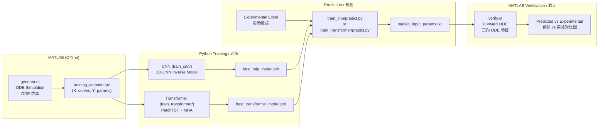

# DNA Nanorobot Inverse Design & Verification System

# DNA 纳米机器人逆向设计与验证系统

> **Inverse design of physical parameters for a light-controlled DNA Walker nanorobot using deep learning.**
>
> **利用深度学习反推光控 DNA Walker 纳米机器人物理参数。**

---

## Table of Contents / 目录

- [Introduction / 简介](#introduction--简介)
- [System Architecture / 系统架构](#system-architecture--系统架构)
- [Directory Structure / 目录结构](#directory-structure--目录结构)
- [Predicted Parameters / 预测参数说明](#predicted-parameters--预测参数说明)
- [End-to-End Workflow / 端到端工作流](#end-to-end-workflow--端到端工作流)
  - [Step 1: Data Generation (MATLAB) / 数据生成](#step-1-data-generation-matlab--数据生成)
  - [Step 2: CNN Training / CNN 训练](#step-2-cnn-training--cnn-训练)
  - [Step 3: Transformer Training / Transformer 训练](#step-3-transformer-training--transformer-训练)
  - [Step 4: Prediction / 预测](#step-4-prediction--预测)
  - [Step 5: MATLAB Verification / MATLAB 验证](#step-5-matlab-verification--matlab-验证)
- [Smoke Test / 冒烟测试](#smoke-test--冒烟测试)
- [Setup / 环境配置](#setup--环境配置)
- [Configuration / 配置文件说明](#configuration--配置文件说明)
- [HPC Guide / HPC 使用指南](#hpc-guide--hpc-使用指南)

---

## Introduction / 简介

This project builds the complete machine learning pipeline for inverse design of a
**light-controlled DNA Walker nanorobot**. Given three fluorescence intensity curves
(FAM, TYE, CY5) measured experimentally, the system predicts 7 physical parameters
that govern the walker's behavior using a 14-state Markov transition model.

本项目构建了**光控 DNA Walker 纳米机器人**逆向设计的完整机器学习流程。
给定三条实验荧光曲线（FAM、TYE、CY5），系统基于 14 态马尔可夫跳转模型
预测控制 Walker 行为的 7 个物理参数。

Two parallel model architectures are provided:
| Model | Architecture | Input Shape | Strength |
|-------|-------------|-------------|----------|
| **CNN (MLP)** | 1D-Conv → FC → Sigmoid | `(N, 23403)` flattened | Fast, robust baseline |
| **Transformer** | PatchTST + MHA → Sigmoid | `(N, 3, 7801)` 3D | Global receptive field, explicit channel interaction |

---

## System Architecture / 系统架构



---

## Directory Structure / 目录结构

```
MachineLearning_for_DNAwalker/
│
├── configfile.ini              # 全局配置 / Global config (physics, training, data)
├── configfile.smoke.ini        # 冒烟测试配置覆盖 / Smoke test config override
├── config_loader.py            # 统一配置管理类 / Unified config manager
├── README.md                   # 本文件 / This file
├── requirements.txt            # Python 依赖 / Python dependencies
├── .gitignore                  # Git 忽略规则 / Git ignore rules
│
├── train_cnn/                  # ===== CNN (MLP) 模型 =====
│   ├── model_cnn.py            #   InverseCNN 模型定义 / Model definition
│   ├── data_loader.py          #   数据加载与预处理 / Data loading & preprocessing
│   ├── train_mlp.py            #   主训练脚本 / Main training script
│   ├── inference_cnn.py        #   推理模块 / Inference module
│   ├── predict.py              #   实验数据预测 / Experimental prediction
│   ├── verify.m                #   MATLAB 正向验证 / MATLAB forward verification
│   ├── optimize_params.m       #   MATLAB 局部优化 / MATLAB local optimization
│   ├── run_job.sh              #   HPC PBS 作业脚本 / HPC PBS job script
│   └── results/                #   模型输出 / Model outputs (gitignored)
│
├── train_transformer/          # ===== Transformer 模型 =====
│   ├── config_transformer.ini  #   Transformer 专用超参数 / Transformer hyperparams
│   ├── config_loader_transformer.py  # 配置加载器 / Config loader
│   ├── model_transformer.py    #   PatchTST + MHA 模型 / Model definition
│   ├── dataset.py              #   3D 数据加载 / 3D data loading (X stays 3D)
│   ├── train_transformer.py    #   主训练脚本 / Main training script
│   ├── inference_transformer.py #  推理模块 / Inference module
│   ├── predict.py              #   实验数据预测 / Experimental prediction
│   ├── verify.m                #   MATLAB 正向验证 / MATLAB forward verification
│   ├── optimize_params.m       #   MATLAB 局部优化 / MATLAB local optimization
│   ├── run_job.sh              #   HPC PBS 作业脚本 / HPC PBS job script
│   └── results/                #   模型输出 / Model outputs (gitignored)
│
├── utils/                      # ===== 工具脚本 / Utility Scripts =====
│   ├── check_npz.py            #   NPZ 数据集检查 / NPZ dataset inspector
│   ├── mat_to_npz.py           #   MATLAB→NPZ 转换 / MATLAB to NPZ converter
│   └── stretch_data.py         #   实验数据振幅拉伸 / Experimental data stretching
│
├── gendata.m                   # MATLAB 数据生成脚本 / MATLAB data generation
├── gendata_smoke.m             # MATLAB 冒烟数据生成 / MATLAB smoke data generation
├── run_smoke_test.ps1          # 端到端冒烟测试 / End-to-end smoke test
└── results/                    # 共用数据集 / Shared datasets (gitignored)
    ├── training_dataset.npz    #   训练数据 / Training data
    └── *.xlsx                  #   实验数据 / Experimental data
```

---

## Predicted Parameters / 预测参数说明

| Parameter | Physical Meaning / 物理含义 | Unit / 单位 | Log Transform |
|-----------|---------------------------|-------------|---------------|
| `E_b` | Base binding energy / 基础结合能 | eV | No |
| `E_b_azo_trans` | Trans-azobenzene binding energy / 反式偶氮苯结合能 | eV | No |
| `E_b_azo_cis` | Cis-azobenzene binding energy / 顺式偶氮苯结合能 | eV | No |
| `k_mig` | Leg migration rate / 腿迁移速率 | s⁻¹ | No |
| `k0` | Intrinsic unbinding rate / 固有解绑速率 | s⁻¹ | ✅ `log10` |
| `drt_z` | Z-track duty ratio / Z 轨道占空比 | — | No |
| `drt_s` | S-track duty ratio / S 轨道占空比 | — | No |

---

## End-to-End Workflow / 端到端工作流

### Step 1: Data Generation (MATLAB) / 数据生成

Use `gendata.m` to generate synthetic training data via ODE simulation:

使用 `gendata.m` 通过 ODE 仿真生成合成训练数据：

```matlab
% In MATLAB / 在 MATLAB 中
gendata   % Generates training_dataset.mat → convert via mat_to_npz.py
```

```powershell
# Convert to NPZ / 转换为 NPZ 格式
cd utils/
python mat_to_npz.py ../path/to/training_dataset.mat
```

**Output / 输出:** `results/training_dataset.npz` containing `X(N, 3, 7801)` curves and `Y(N, 7)` parameters.

---

### Step 2: CNN Training / CNN 训练

```powershell
cd train_cnn/
python train_mlp.py
```

- Uses AdaptiveWeightedMSE loss with ReduceLROnPlateau scheduler.
- 使用自适应加权 MSE 损失 + ReduceLROnPlateau 学习率调度。
- **Output / 输出:** `results/best_mlp_model.pth`, `results/y_scaler.pkl`

---

### Step 3: Transformer Training / Transformer 训练

```powershell
cd train_transformer/
python train_transformer.py              # Full training / 正式训练
python train_transformer.py --smoke      # Smoke test / 烟雾测试
```

- Uses AdamW optimizer with Cosine Warmup scheduler.
- PatchTST architecture with Multi-Head Attention for temporal and cross-channel modeling.
- 使用 AdamW 优化器 + Cosine Warmup 学习率调度。
- PatchTST 架构 + 多头注意力机制，分别建模时间维度和跨通道关系。
- **Output / 输出:** `results/best_transformer_model.pth`

---

### Step 4: Prediction / 预测

```powershell
# CNN prediction / CNN 预测
cd train_cnn/
python predict.py

# Transformer prediction / Transformer 预测
cd train_transformer/
python predict.py
```

Pipeline: Load Excel → Interpolation → SG Smoothing → DL Prediction (Test-Time Ensemble) → `matlab_input_params.txt`

流程：加载 Excel → 插值 → SG 平滑 → DL 预测（测试时集成）→ `matlab_input_params.txt`

---

### Step 5: MATLAB Verification / MATLAB 验证

```matlab
% In MATLAB / 在 MATLAB 中
cd train_cnn        % or cd train_transformer
verify              % Reads matlab_input_params.txt, runs forward ODE, plots comparison
```

This runs the forward ODE simulation with the predicted parameters and overlays the result on the experimental curves for visual verification.

使用预测参数运行正向 ODE 仿真，并与实验曲线叠加对比以进行目视验证。

---

## Smoke Test / 冒烟测试

We provide an automated smoke test script to quickly verify that the entire pipeline (data generation, format conversion, CNN training, and Transformer training) is functioning correctly without waiting for a full dataset generation or training process.

我们提供了一个自动化的冒烟测试脚本，可以快速验证整个工作流（数据生成、格式转换、CNN 训练和 Transformer 训练）是否正常运行，这就无需漫长地等待完整的数据集生成或模型训练过程。

```powershell
# Run the complete smoke test / 运行完整的冒烟测试
.\run_smoke_test.ps1
```

**Steps executed during the smoke test / 冒烟测试执行的步骤:**
1. **Data Generation / 数据生成:** Runs `gendata_smoke.m` in MATLAB to rapidly generate a miniature dataset (`training_dataset_smoke.mat`) with 20 samples.
2. **Format Conversion / 格式转换:** Uses `mat_to_npz.py` to convert the `.mat` file into `.npz` format.
3. **CNN Smoke Training / CNN 冒烟训练:** Runs `train_mlp.py` using `configfile.smoke.ini` (which specifies lightweight epochs/batch limits) to train for 2 epochs and evaluate the logic.
4. **Transformer Smoke Training / Transformer 冒烟训练:** Runs `train_transformer.py` using the `--smoke` flag along with smoke configuration file overrides (`config_transformer.smoke.ini`), also training just for a few epochs.

This is highly recommended after modifying any core module to ensure no critical bugs were introduced into the pipeline logic.

强烈建议在修改核心模块后运行此冒烟测试，以确保没有引入会破坏流水线原本逻辑的错误。

---

## Setup / 环境配置

```powershell
# Create conda environment / 创建 conda 环境
conda create -n dna_env python=3.10
conda activate dna_env

# Install PyTorch (CUDA 12.4) / 安装 PyTorch
pip install torch torchvision --index-url https://download.pytorch.org/whl/cu124

# Install other dependencies / 安装其他依赖
pip install -r requirements.txt
```

**Key dependencies / 关键依赖:** `torch`, `numpy`, `scipy`, `scikit-learn`, `pandas`, `openpyxl`, `h5py`

---

## Configuration / 配置文件说明

### `configfile.ini` (Root / 根目录)

Global configuration shared by both CNN and Transformer:

CNN 和 Transformer 共用的全局配置：

| Section | Contents / 内容 |
|---------|----------------|
| `[TRAINING]` | Learning rate, batch size, epochs, scheduler, dataset split / 学习率、批次、轮数等 |
| `[MODEL_ARCHITECTURE]` | CNN Conv/FC layer params / CNN 卷积/全连接层参数 |
| `[DATA_PROCESSING]` | Log transform, NaN cleanup, amplitude filter / 对数变换、数据清洗 |
| `[DATA_GENERATION]` | Output filename / 输出文件名 |
| `[PHYSICAL_PARAMETERS]` | Fixed/trainable params / 固定/可训练参数 |
| `[TRAINING_PARAMETER_RANGES]` | Min-max ranges / 参数范围 |
| `[NANOROBOT_MODELING]` | Experimental data path, simulation time / 实验数据路径、仿真时间 |
| `[PREDICTION]` | SG smoothing, Test-Time Ensemble / SG 平滑、集成预测 |

### `config_transformer.ini` (train_transformer/)

Transformer-specific hyperparameters:

| Section | Contents / 内容 |
|---------|----------------|
| `[TRANSFORMER]` | d_model, n_heads, n_layers, patch_size, dropout, optimizer / 模型结构、优化器 |
| `[PATHS]` | Dataset file path / 数据集路径 |

---

## HPC Guide / HPC 使用指南

All training scripts include PBS job scripts for HPC clusters:

所有训练脚本都包含 PBS 作业脚本：

```powershell
# CNN training on HPC / HPC 上训练 CNN
cd train_cnn/
qsub run_job.sh

# Transformer training on HPC / HPC 上训练 Transformer
cd train_transformer/
qsub run_job.sh
```

---

## Model Architecture Comparison / 模型架构对比

|  | CNN (`train_cnn/`) | Transformer (`train_transformer/`) |
|--|---|---|
| **Input / 输入** | `(N, 23403)` flattened / 展平 | `(N, 3, 7801)` 3D |
| **Long-range / 长程依赖** | ❌ Local receptive field / 局部感受野 | ✅ Global via Multi-Head Attention / 全局 |
| **Channel relation / 通道关系** | Implicit fusion / 隐式融合 | Explicit Cross-Channel Attention / 显式 |
| **Optimizer / 优化器** | Adam | AdamW |
| **LR Schedule / 学习率调度** | ReduceLROnPlateau | Cosine Warmup |
| **Parameters / 参数量** | ~7M | ~4.5M |

---

## Normalization Strategy / 归一化策略

Both models use the same **Domain Invariant** normalization:

两个模型使用相同的 **Domain Invariant** 归一化策略：

- **X (curves):** Per-sample joint-channel z-score normalization
  - 单样本联合通道 z-score 归一化
  - `X_norm = (X - μ_sample) / σ_sample` across all 3 channels jointly
- **Y (params):** MinMaxScaler to [0.1, 0.9] (Safe Sigmoid Lock)
  - MinMaxScaler 缩放至 [0.1, 0.9]，配合 Sigmoid 输出避免梯度死区
- **k0:** log10 transform before scaling to handle large dynamic range
  - 先 log10 变换再缩放，处理大动态范围
