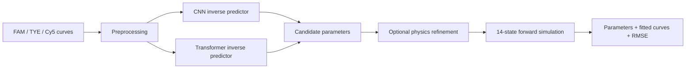
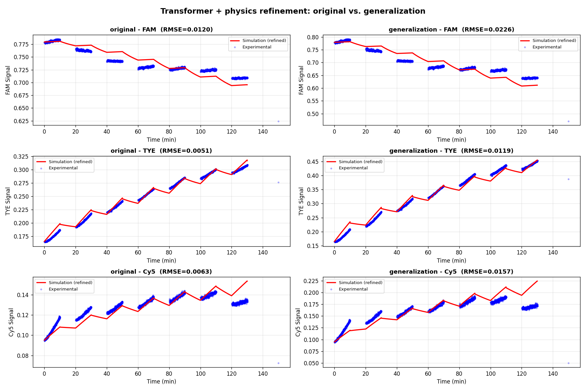
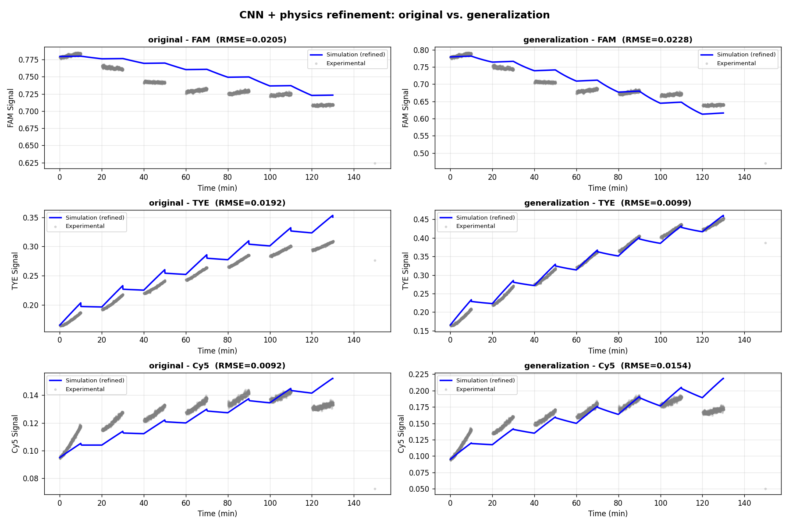
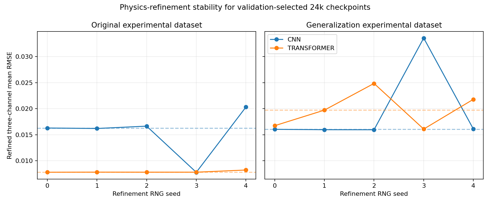
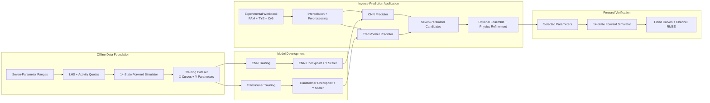
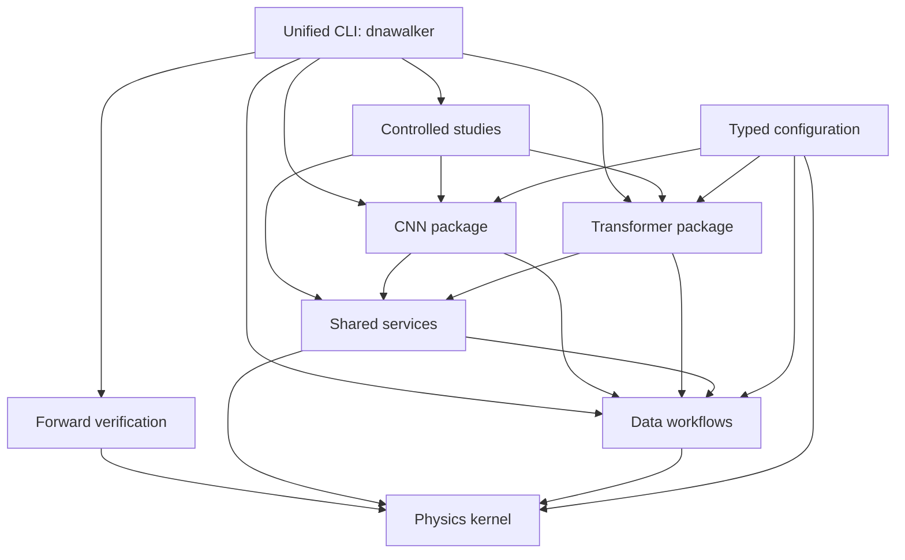
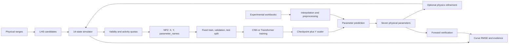
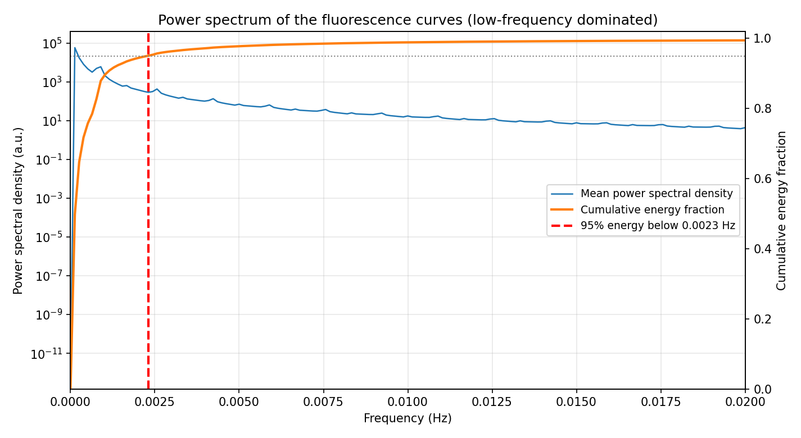
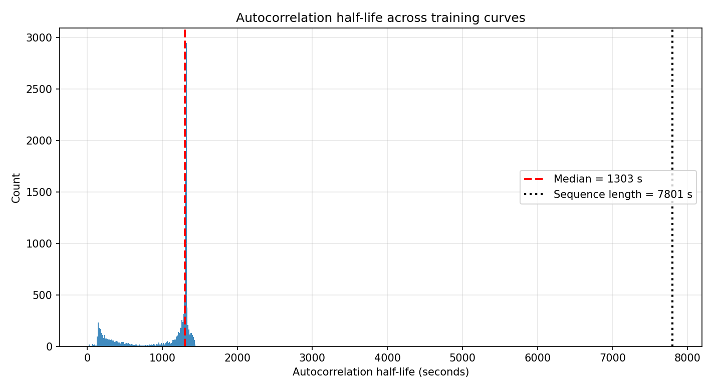

# DNA Walker Physical-Parameter Inverse Prediction

# DNA Walker 物理参数逆向预测

> An application-oriented system that predicts seven physical parameters of a
> light-controlled DNA molecular walker from three fluorescence curves (FAM,
> TYE, and Cy5), then verifies the candidate solution with forward physics.
>
> 面向应用的 DNA Walker 逆向预测系统：根据三条荧光曲线（FAM、TYE 和 Cy5）
> 预测七个物理参数，再通过正向物理模型验证候选解。

This repository implements a pure-Python inverse-prediction application.
Given experimental fluorescence curves, either a CNN or Transformer produces
a fast seven-parameter estimate; optional bounded physics refinement improves
curve agreement, and forward simulation reports the final channel-wise error.
Controlled model comparisons and identifiability studies validate this
application, but they are not the project's primary deliverable.

本仓库实现了一套纯 Python 逆向预测应用。输入实验荧光曲线后，CNN 或 Transformer
可快速预测七个参数；可选的有界物理精修进一步改善曲线拟合，最后通过正向模拟报告
各通道误差。受控模型对比与可辨识性研究用于验证这套应用，但不是项目的主要交付目标。

**Last synchronized / 最后同步：2026-07-30**

Figure labels and machine-readable fields remain in English for font and tool
portability; the explanatory README text is bilingual.

为避免 CJK 字体缺失并保持工具兼容性，图片标签和机器可读字段继续使用英文；README
说明正文采用中英对照。

---

<a id="contents"></a>
## Contents / 目录

- [Application Overview / 应用概览](#application)
- [Application Results and Recommended Strategy / 应用结果与推荐路线](#results)
- [Current Best Observed Result / 当前最佳观察结果](#best-result)
- [Experimental Curve Result Figures / 实验曲线结果图](#result-figures)
- [Future Application Direction / 未来应用方向](#future-application)
- [Supporting Validation / 支撑性验证](#validation)
- [System Architecture / 系统架构](#architecture)
- [Repository Layout / 目录结构](#layout)
- [Scientific Scope / 科学问题](#scope)
- [Physical Parameters / 物理参数](#parameters)
- [Data Generation / 数据生成](#data-generation)
- [Models and Preprocessing / 模型与预处理](#models)
- [End-to-End Workflow / 端到端流程](#workflow)
- [Apply to Your Own Workbook / 使用自有实验数据](#own-workbook)
- [Installation / 环境安装](#installation)
- [Configuration and Reproducibility / 配置与可复现性](#reproducibility)
- [Complete Repository Tree / 完整目录树](#complete-layout)
- [Artifacts and Publication Boundary / 制品与发布边界](#artifacts)
- [Verification / 验证](#verification)
- [Documentation / 文档](#documentation)
- [License / 许可证](#license)

---

<a id="application"></a>
## Application Overview / 应用概览

The primary deliverable is a reusable **curve-to-parameter inverse predictor**,
not an architecture-ranking benchmark. Its operational contract is:

本项目的主要交付物是可复用的**曲线到参数逆向预测器**，而不是模型架构排名基准。
应用契约如下：

| Stage / 阶段 | Application contract / 应用契约 |
|---|---|
| Input / 输入 | Three FAM, TYE, and Cy5 fluorescence curves over 130 minutes / 130 分钟内的 FAM、TYE、Cy5 三条荧光曲线 |
| Fast inverse estimate / 快速逆向初值 | CNN or Transformer predicts seven bounded physical parameters / CNN 或 Transformer 预测七个有界物理参数 |
| Robustification / 稳健化 | Optional test-time ensemble perturbs the curves and aggregates predictions / 可选测试时集成对曲线扰动并汇总预测 |
| Physics refinement / 物理精修 | Bounded multi-start optimization minimizes curve RMSE through the 14-state simulator / 有界多起点优化通过 14 状态模拟器最小化曲线 RMSE |
| Verification / 验证 | Forward simulation compares the candidate with all three observed channels / 正向模拟将候选解与三条观测曲线逐一比较 |
| Output / 输出 | Seven curve-consistent parameters, a parameter file, simulated curves, and channel-wise RMSE / 七个曲线一致参数、参数文件、模拟曲线及逐通道 RMSE |



Both inverse models are complete and usable with their matching checkpoint and
Y-scaler artifacts. They provide alternative initializations for the same
physics-constrained application; the controlled studies exist to determine how
these initializations should be used, not to redefine the project as a
benchmark.

两种逆向模型均已完成，只要配套 checkpoint 与 Y scaler 匹配即可使用。它们为同一个
物理约束应用提供不同初值；受控研究的作用是决定如何使用这些初值，而不是把项目重新
定义成模型排名实验。

The public tree includes the validation-selected CNN and Transformer
checkpoints, their paired Y scalers, the required split manifest, and a
SHA-256 manifest under `artifacts/application/`. It supports inference and
physics refinement on a user-supplied workbook without the training dataset.
Fresh Linux/CUDA validation, remote CI, and redistribution permission for the
reviewed experimental inputs remain publication tasks.

公开目录已在 `artifacts/application/` 中包含按验证集选出的 CNN 与 Transformer
checkpoint、配套 Y scaler、所需划分清单及 SHA-256 清单。即使不提供训练数据集，也可
对用户自己的工作簿执行推理与物理精修。全新 Linux/CUDA 验证、远程 CI，以及已审查
实验输入的再分发许可仍属于发布工作。详见
[Publication Boundary / 发布边界](docs/PUBLICATION.md)。

---

<a id="results"></a>
<a id="recommendation"></a>
## Application Results and Recommended Strategy / 应用结果与推荐路线

<a id="best-result"></a>
### Current Best Observed Result / 当前最佳观察结果

When one existing branch must be selected, the current application default is
the **validation-selected 24k Transformer checkpoint followed by test-time
ensemble and Powell physics refinement**. Across the two available
experimental workbooks and refinement seeds 0-4, it has the lowest observed
combined median curve RMSE:

如果当前必须只选择一条现有路线，推荐默认使用：**按验证集选出的 24k Transformer
checkpoint + 测试时集成 + Powell 物理精修**。在现有两份实验工作簿及精修种子 0-4
上，它取得了最低的合并中位曲线 RMSE：

| Application branch / 应用路线 | Original median / 原始中位数 | Generalization median / 泛化中位数 | Combined median / 合并中位数 |
|---|---:|---:|---:|
| CNN + physics refinement / CNN + 物理精修 | `0.016290` | **`0.016038`** | `0.016303` |
| Transformer + physics refinement / Transformer + 物理精修 | **`0.007806`** | `0.019721` | **`0.013767`** |

This is the **best observed application result**, not proof that Transformer is
universally superior. CNN is better on the generalization workbook, and direct
24k held-out means are almost identical (`0.01811960` for CNN and `0.01817831`
for Transformer). Descriptively, the Transformer branch's combined median is
about 15.6% lower than the CNN branch's, but five refinement seeds and two
workbooks do not establish universal superiority. The recommendation therefore
concerns the complete prediction-plus-refinement workflow under the current
evidence, not an architecture-wide claim.

这是**当前观察到的最佳应用结果**，并不证明 Transformer 在所有场景都更优。CNN 在
泛化工作簿上更好，而且 24k 直接留出测试均值几乎相同（CNN 为 `0.01811960`，
Transformer 为 `0.01817831`）。从描述性结果看，Transformer 路线的合并中位数比
CNN 低约 15.6%，但五个精修种子和两份工作簿不足以证明普遍优势。因此，该推荐针对
当前证据下完整的“预测 + 精修”流程，而不是对模型架构作普遍优劣判断。

<a id="result-figures"></a>
### Experimental Curve Result Figures / 实验曲线结果图

#### Recommended branch: Transformer + physics refinement / 推荐路线：Transformer + 物理精修

The six panels show refinement seed 0 against FAM, TYE, and Cy5 for both
experimental workbooks. The table above, rather than this one visualized seed,
defines the recommendation across seeds 0-4.

六个面板展示精修 seed 0 在两份实验数据中 FAM、TYE、Cy5 的模拟曲线与实验数据。
当前推荐依据是上表对 seed 0-4 的汇总，而不是仅依据图中这一个种子。



#### Complementary branch: CNN + physics refinement / 互补路线：CNN + 物理精修

This figure also shows refinement seed 0. The CNN branch remains important
because its five-seed aggregate gives the lower median RMSE on the
generalization workbook and therefore supplies a genuinely different candidate
for physics-based selection.

该图同样展示精修 seed 0。CNN 路线在五个种子的汇总中取得更低的泛化工作簿中位
RMSE，因此仍是物理择优过程中具有实际价值的互补候选。



Run the current default application path with:

当前默认应用路线：

```bash
bash scripts/run_application.sh \
  --exp data/experimental/Fig3a_fitting.xlsx \
  --model transformer \
  --run-name experiment_01
```

This one-command runner uses the validation-selected 24k Transformer and the
documented ensemble/refinement settings. The equivalent expanded commands are:

该一键脚本使用按验证集选出的 24k Transformer 以及文档锁定的集成/精修设置。等价的
完整命令如下：

```bash
python -m dnawalker transformer predict --refine \
  --config configs/studies/nested_30k/transformer_seed46.ini \
  --transformer-config configs/studies/nested_30k/transformer_seed46.ini \
  --exp data/experimental/Fig3a_fitting.xlsx \
  --ensemble 20 \
  --noise-std 0.005 \
  --method Powell \
  --maxiter 500 \
  --multistart 8 \
  --out results/predictions/transformer/train24k_seed46/matlab_input_params.txt

python -m dnawalker verify \
  results/predictions/transformer/train24k_seed46/matlab_input_params.txt
```

The matching CNN command remains a supported alternative:

CNN 路线仍是完整支持的备选方案：

```bash
python -m dnawalker cnn predict --refine \
  --config configs/studies/nested_30k/cnn_seed43.ini \
  --ensemble 20 \
  --noise-std 0.005 \
  --method Powell \
  --maxiter 500 \
  --multistart 8 \
  --out results/predictions/cnn/train24k_seed43/matlab_input_params.txt
```

<a id="future-application"></a>
### Future Application Direction / 未来应用方向

The strongest deployment direction is a **dual-initializer,
physics-selected predictor**:

最值得推进的应用方向是**双模型初始化、物理模型择优的预测器**：

1. Run the same three curves through the provenance-valid CNN and Transformer.
   将同一组三通道曲线分别输入来源校验通过的 CNN 与 Transformer。
2. Apply the same ensemble and bounded multi-start refinement to both initial
   estimates.
   对两组初值使用相同的集成和有界多起点精修。
3. Forward-simulate both refined candidates against the observed curves.
   将两组精修候选解正向模拟，并与观测曲线比较。
4. Select the candidate with the lower three-channel RMSE, while retaining the
   runner-up and seed spread as uncertainty information.
   选择三通道 RMSE 更低的候选解，同时保留另一候选解及不同精修种子的离散程度作为
   不确定性信息。

This strategy uses information available at inference time and preserves the
complementary strengths observed here: Transformer gives the best combined
median, while CNN can win on a shifted experimental trace. The model CLIs run
the branches separately; `scripts/run_application.sh --model both` launches
and verifies both in one command, but automatic machine-readable winner
selection and structured uncertainty remain future application features.

该策略只使用预测时可获得的信息，并保留当前观察到的互补优势：Transformer 的合并
中位结果最好，而 CNN 在发生分布变化的实验曲线上可能更优。模型 CLI 分别运行两条
路线；`scripts/run_application.sh --model both` 可用一条命令依次预测并验证两支，
但自动输出机器可读的胜者与结构化不确定性仍是后续应用功能。

The refinement-seed result below makes the reason visible: neither initializer
wins every experimental trace and every optimizer start.

下图直观展示了采用双模型候选的原因：没有一种初始化方法能在每条实验曲线和每个
优化起点上始终占优。

#### Refinement Stability / 精修稳定性



**Application boundary:** the inverse problem is severely ill-conditioned.
Predicted values are curve-consistent candidate parameters, not guaranteed
unique microscopic ground truth. A production interface should therefore
return fitted curves, per-channel RMSE, provenance, and uncertainty alongside
the seven values.

**应用边界：**该逆问题严重病态。预测结果是与曲线一致的候选参数，不保证等同于唯一
微观真实值。因此，正式应用界面应在七个参数之外同时返回拟合曲线、逐通道 RMSE、
制品来源和不确定性。

<a id="validation"></a>
### Supporting Validation / 支撑性验证

The comparison work supports the application without becoming its main goal:

模型对比用于支撑应用选择，而不是项目本身的主要目标：

- Both CNN and Transformer are viable inverse initializers.
  CNN 与 Transformer 都可以作为有效的逆向初值生成器。
- Thirty controlled 8k/16k/24k training runs show that both improve with more
  retained data.
  30 次受控的 8k/16k/24k 训练表明，两种方法都会随保留训练数据增加而改善。
- Neither direct architecture has a stable proven advantage; at 24k their mean
  held-out curve RMSE is a near-tie.
  两种直接预测架构都没有被证明具有稳定优势；24k 留出曲线 RMSE 均值接近持平。
- Experimental prediction plus refinement currently favors Transformer on the
  combined median, but the per-workbook reversal motivates dual-model
  selection.
  实验预测加精修的合并中位结果当前更偏向 Transformer，但不同工作簿上的优劣反转
  正是采用双模型择优的依据。
- Identifiability analysis limits parameter interpretation even when curve
  agreement is strong.
  即使曲线拟合很好，可辨识性分析仍限制了参数解释范围。

The complete statistics, data lineages, confidence intervals, figures,
refinement-robustness results, and claim boundaries are documented in
[Model Comparison and Application Selection](docs/MODEL_COMPARISON.md).
The locked 30k design remains in
[LEARNING_CURVE_PROTOCOL.md](docs/LEARNING_CURVE_PROTOCOL.md), and the
machine-readable records remain under [docs/evidence/](docs/evidence/).

完整统计、数据谱系、置信区间、结果图、精修稳定性与结论边界见
[模型对比与应用选择](docs/MODEL_COMPARISON.md)。锁定的 30k 实验设计仍记录在
[LEARNING_CURVE_PROTOCOL.md](docs/LEARNING_CURVE_PROTOCOL.md)，机器可读记录仍位于
[docs/evidence/](docs/evidence/)。

---

<a id="architecture"></a>
## System Architecture / 系统架构

The project uses a **model-first package layout**: a reader can enter
`dnawalker/cnn/` or `dnawalker/transformer/` and find that model's
configuration, data adapter, architecture, trainer, predictor, and evaluator
in one place. Physics, data contracts, and behavior genuinely shared by both
models stay in small top-level packages.

项目采用**模型优先的包结构**：进入 `dnawalker/cnn/` 或
`dnawalker/transformer/`，即可在同一目录中找到该模型的配置、数据适配器、网络结构、
训练、预测和评估入口。两种模型真正共享的物理、数据契约与通用行为则保留在独立的
顶层包中。

### End-to-End Application Architecture / 端到端应用架构

This is the current pure-Python equivalent of the earlier architecture
overview. Training is an offline artifact-producing stage; normal application
use starts from a user-supplied experimental workbook and the bundled selected
model artifacts.

这是早期架构总图在当前纯 Python 项目中的对应版本。模型训练属于离线制品生成阶段；
普通应用从用户提供的实验工作簿和随附的选定模型制品开始。



### Architectural Layers / 架构分层



Dependencies point downward. `physics`, `config`, and low-level data helpers do
not import a model or study. Model packages do not import study orchestration.
This direction keeps the 14-state simulator and scientific contracts reusable
without creating circular ownership.

依赖只向下流动。`physics`、`config` 和底层数据工具不会反向导入模型或研究流程；
模型包也不会依赖研究调度层。这个方向保证 14 状态模拟器与科学契约可以独立复用，
同时避免循环归属。

| Layer / 层 | Package / 包 | Responsibility / 职责 |
|---|---|---|
| Command surface / 命令入口 | `dnawalker.cli`, `dnawalker.__main__` | One discoverable command tree and lazy dispatch / 单一、可发现的命令树与延迟分发 |
| Model workflows / 模型流程 | `dnawalker.cnn`, `dnawalker.transformer` | Architecture-specific config, tensors, training, inference, prediction, evaluation / 模型专属配置、张量形式、训练、推理、预测与评估 |
| Scientific studies / 科学研究 | `dnawalker.studies` | Multi-seed, nested learning curve, identifiability, signal, and fit-robustness protocols / 多种子、嵌套学习曲线、可辨识性、信号与拟合稳定性协议 |
| Shared services / 共享服务 | `dnawalker.shared` | Artifact hashes, devices, seeds, parameter I/O, ensemble, shared pipelines, held-out accounting / 制品哈希、设备、种子、参数 I/O、集成、共享流程与留出计数 |
| Data contract / 数据契约 | `dnawalker.data` | Generation, experimental input, preprocessing, and dataset splits / 数据生成、实验输入、预处理与数据划分 |
| Physics kernel / 物理内核 | `dnawalker.physics` | 14-state forward simulation and bounded physical refinement / 14 状态正向模拟与有界物理精修 |
| Configuration / 配置 | `dnawalker.config`, model `config.py` | Typed common/model configuration and repository-root discovery / 类型化共享与模型配置、仓库根目录发现 |
| Utilities / 工具 | `dnawalker.tools`, `dnawalker.verify` | NPZ inspection, MAT conversion, and forward verification / NPZ 检查、MAT 转换与正向验证 |

### Runtime Data Flow / 运行时数据流



The checkpoint and fitted Y scaler are one inseparable artifact pair. The
checkpoint records dataset/scaler hashes, ordered parameter names, model and
split seeds, epoch, and validation score. A dataset, scaler, or parameter-order
change creates a new lineage and requires retraining.

Checkpoint 与拟合后的 Y scaler 是不可拆分的制品对。Checkpoint 内记录数据集/scaler
哈希、有序参数名、模型种子、划分种子、epoch 与验证分数。只要数据集、scaler 或参数
顺序发生变化，就会形成新谱系并需要重新训练。

### Configuration Flow / 配置流

```text
configs/common.ini
        |
        +---- configs/cnn.ini -----------+
        |                                +--> optional profile/study override
        +---- configs/transformer.ini ---+
```

`common.ini` owns physics, parameter ranges, generation, preprocessing,
dataset splits, shared seeds, and prediction settings. `cnn.ini` and
`transformer.ini` own only architecture-specific training values and artifact
paths. A profile or study file is applied last and contains only intentional
differences.

`common.ini` 负责物理参数、参数范围、数据生成、预处理、数据划分、共享种子和预测设置；
`cnn.ini` 与 `transformer.ini` 只负责各自模型的训练参数、网络结构和制品路径。Profile
或研究覆盖文件最后加载，并且只写有意改变的值。

The refactor was checked against the pre-move configuration baseline: all
**76 zero-argument typed getters matched exactly**. No model equation,
preprocessing rule, split, seed, or scientific artifact was changed.

本次结构调整已与搬迁前配置基线逐项比较：**76 个无参数类型化 getter 全部完全一致**。
模型方程、预处理规则、数据划分、随机种子和科学制品均未改变。

---

<a id="layout"></a>
## Repository Layout / 目录结构

The active repository is organized around the two inverse-prediction methods.
This compact tree is the recommended starting map; the
[complete commented tree](#complete-layout) remains later in this README.

当前仓库围绕两种逆向预测方法组织。下面是建议首先阅读的核心目录图；README 后文仍
保留[完整带注释目录树](#complete-layout)。

```text
MechineLearning_for_DNAwalker-main/
├── README.md                    # Application guide / 应用入口
├── configs/                     # Shared, CNN, Transformer, study configs / 分层配置
├── dnawalker/                   # Importable Python package / Python 运行包
│   ├── cli.py                   # Unified command tree / 统一命令入口
│   ├── config.py                # Shared typed configuration / 共享配置
│   ├── physics/                 # 14-state simulator and refinement / 正向模拟与精修
│   ├── data/                    # Generation and experimental preprocessing / 数据流程
│   ├── cnn/                     # CNN model, train, predict, evaluate / CNN 完整流程
│   ├── transformer/             # Transformer model, train, predict, evaluate / Transformer 完整流程
│   ├── shared/                  # Ensemble, provenance, parameter I/O / 跨模型服务
│   ├── studies/                 # Supporting validation studies / 支撑性验证研究
│   └── tools/                   # Dataset utilities / 数据工具
├── data/experimental/           # Local experimental workbooks / 本地实验数据
├── artifacts/application/       # Published selected models / 已发布选定模型
├── results/                     # Predictions, metrics, plots, logs / 可重建输出
├── scripts/                     # Smoke, evidence, and HPC scripts / 运维脚本
├── docs/                        # Architecture, method selection, evidence / 文档与证据
└── tests/                       # Regression suite / 回归测试
```

The primary application path is therefore easy to locate:
`dnawalker/{cnn,transformer}/predict.py` provides the learned inverse estimate,
`dnawalker/physics/refinement.py` improves curve agreement, and
`dnawalker/verify.py` performs final forward verification.

主要应用路径可以直接定位：`dnawalker/{cnn,transformer}/predict.py` 负责学习型逆向
预测，`dnawalker/physics/refinement.py` 改善曲线拟合，
`dnawalker/verify.py` 完成最终正向验证。

---

<a id="scope"></a>
## Scientific Scope / 科学问题

The forward problem maps seven physical parameters to three fluorescence time
series using a 14-state Markov model. Each channel contains 7,801 points over
130 minutes at one-second resolution:

正向问题使用 14 状态马尔可夫模型，将七个物理参数映射为三条荧光时间序列。
每个通道覆盖 130 分钟，以一秒为间隔，共 7,801 个时间点：

```text
7 physical parameters
        |
        v
14-state forward simulator
        |
        v
FAM, TYE, Cy5 curves: (3, 7801)
```

The inverse problem runs in the opposite direction. CNN and Transformer models
provide fast initial parameter estimates; optional model-agnostic refinement
then minimizes curve RMSE directly through the shared physics simulator.

逆向问题沿相反方向求解。CNN 与 Transformer 先给出快速的参数初值；随后可选的、
与模型架构无关的精修过程，通过共享物理模拟器直接最小化曲线 RMSE。

```text
Experimental or synthetic curves
        |
        +-------------------+
        |                   |
        v                   v
   CNN inverse model   Transformer inverse model
        |                   |
        +---------+---------+
                  |
                  v
       optional physics refinement
                  |
                  v
      forward simulation and RMSE
```

The central application criterion is not only whether a network emits a
seven-value vector, but whether those values reproduce the observed curves.
Identifiability analysis then limits how strongly that candidate may be
interpreted as a unique physical solution.

核心应用标准不只是神经网络能否输出七个数值，更重要的是这些数值能否重现实验曲线；
可辨识性分析进一步限制了候选解能否被解释为唯一物理解。

---

<a id="parameters"></a>
## Physical Parameters / 物理参数

| Parameter / 参数 | Physical meaning / 物理含义 | Unit / 单位 | Training transform / 训练变换 |
|---|---|---|---|
| `E_b` | Base-pair binding energy / 碱基配对结合能 | `kBT` | Linear / 线性 |
| `E_b_azo_trans` | Trans-azobenzene hairpin energy / 反式偶氮苯发夹能 | `kBT` | Linear / 线性 |
| `E_b_azo_cis` | Cis-azobenzene hairpin energy / 顺式偶氮苯发夹能 | `kBT` | Linear / 线性 |
| `k_mig` | Leg migration rate / 腿迁移速率 | `s^-1` | Linear / 线性 |
| `k0` | Intrinsic unbinding rate / 固有解绑速率 | `s^-1` | `log10` |
| `drt_z` | Unzipping force-coupling distance / 解链方向力耦合距离 | `nm` | Linear / 线性 |
| `drt_s` | Shearing force-coupling distance / 剪切方向力耦合距离 | `nm` | Linear / 线性 |

Parameter ranges and fixed structural constants are defined in
[`configs/common.ini`](configs/common.ini). Parameter order is part of the dataset
and checkpoint contract and must not be changed without retraining.

参数范围与固定结构常数定义在 [`configs/common.ini`](configs/common.ini) 中。参数顺序是
数据集和 checkpoint 契约的一部分，修改顺序后必须重新训练。

---

<a id="data-generation"></a>
## Data Generation / 数据生成

The generator is the canonical pure-Python replacement for the historical
MATLAB generation workflow. It writes:

当前生成器是历史 MATLAB 数据生成流程的规范纯 Python 替代实现，输出：

```text
X: (N, 3, 7801) float32 fluorescence curves
Y: (N, 7)       float64 physical parameters
parameter_names: canonical ordered parameter names
```

Its selection pipeline is:

数据筛选流程为：

1. Latin Hypercube Sampling (LHS) in the configured seven-dimensional
   parameter box.
   在配置规定的七维参数空间中执行 Latin Hypercube Sampling（LHS）。
2. Forward simulation through `dnawalker.physics.simulator`.
   通过 `dnawalker.physics.simulator` 执行正向模拟。
3. Physical-validity and finite-value checks.
   检查物理有效性与数值有限性。
4. Weak-signal rejection.
   剔除弱信号样本。
5. Activity-bin quotas to prevent low-activity curves from dominating.
   使用活跃度分箱配额，防止低活跃度曲线占据大多数样本。
6. Atomic output only after the exact requested sample count is reached.
   只有恰好达到目标样本数后才原子写入文件，不保存不完整数据集。

LHS describes **candidate generation**, not the final retained distribution.
Filtering and activity quotas alter the retained marginals. The reviewed 30k
dataset has 30,000 unique parameter rows and exact `6000 x 5` activity counts,
but its retained seven-dimensional distribution is not uniform. The strongest
retained correlation is `corr(E_b, E_b_azo_cis)=0.43853`.

LHS 描述的是**候选样本生成方式**，而不是最终保留数据的分布。物理过滤和活跃度配额
会改变保留样本的边缘分布。已审查的 30k 数据集包含 30,000 组唯一参数，并具有精确的
`6000 x 5` 活跃度分箱计数，但最终七维分布并不均匀。最强保留相关性为
`corr(E_b, E_b_azo_cis)=0.43853`。

The fixed 3k test set remains representative of this retained distribution:
its maximum normalized mean difference from the master is `0.007086`, and its
maximum two-sample KS statistic is `0.0225`.

固定的 3k 测试集仍能代表该保留分布：相对主数据集的最大归一化均值差为
`0.007086`，最大双样本 KS 统计量为 `0.0225`。

---

<a id="models"></a>
## Models and Preprocessing / 模型与预处理

| Component / 项目 | CNN | Transformer |
|---|---|---|
| Input / 输入 | Flattened `(N, 23403)`, reshaped to `(N, 3, 7801)` / 展平后在模型内恢复形状 | `(N, 3, 7801)` |
| Feature path / 特征路径 | 4 Conv1d blocks, adaptive pooling, MLP head / 四层一维卷积、自适应池化、MLP 回归头 | Patch embedding, temporal attention, cross-channel attention / Patch 嵌入、时间注意力、跨通道注意力 |
| Output / 输出 | 7 sigmoid-bounded values / 7 个 Sigmoid 有界值 | 7 sigmoid-bounded values / 7 个 Sigmoid 有界值 |
| Trainable parameters / 可训练参数量 | **`4,381,319`** (`4.38M`) | **`3,243,271`** (`3.24M`) |
| Raw FP32 weight storage / FP32 原始权重体积 | About `16.7 MiB` | About `12.4 MiB` |
| Analytical forward MACs / 解析前向 MAC | About **`38.1M` per sample** | About **`780.2M` per sample** |
| Default batch size / 默认批量 | `256` | `64` |
| Configured epoch cap / 配置 epoch 上限 | `2000` | `300` |
| Optimizer / 优化器 | Adam | AdamW |
| Scheduler / 调度器 | ReduceLROnPlateau | Cosine warmup |
| Main role / 主要作用 | Local multiscale waveform features / 局部多尺度波形特征 | Long-range and channel interactions / 长程与跨通道关系 |

Loading both initializers requires `7,624,590` trainable values in total, or
about `29.1 MiB` of raw FP32 weights before framework and runtime overhead.

同时加载两种初值模型时，共有 `7,624,590` 个可训练数值；不计框架与运行时开销的
FP32 原始权重约为 `29.1 MiB`。

Both architectures share the same parameter order, split contracts, physical
simulator, held-out accounting, refinement implementation, and preprocessing:

两种架构共享相同的参数顺序、数据划分契约、物理模拟器、留出样本计数方式、精修实现和
预处理：

- Curves use per-sample joint-channel z-score normalization.
  曲线采用单样本、三通道联合 z-score 归一化。
- `k0` is transformed with `log10` before target scaling.
  `k0` 在目标缩放前进行 `log10` 变换。
- Targets use `MinMaxScaler(feature_range=(0.1, 0.9))`.
  目标参数使用 `MinMaxScaler(feature_range=(0.1, 0.9))`。
- Training and inference call the same normalization implementation in
  `dnawalker.data.preprocessing`.
  训练与推理共同调用 `dnawalker.data.preprocessing` 中的同一归一化实现。

The signal diagnostics explain why both inductive biases are plausible:
curves are predominantly smooth and low-frequency, while long autocorrelation
still leaves a role for global attention. These diagnostics describe the data;
they do not prove architecture superiority.

信号诊断说明两种归纳偏置都具有合理性：曲线主要是平滑低频信号，同时较长的自相关
又为全局注意力保留了作用空间。这些诊断只描述数据特征，不能证明某种架构更优。

| Spectrum / 频谱 | Autocorrelation / 自相关 |
|---|---|
|  |  |

### Accuracy and Runtime Comparison / 精度与运行成本对比

| Evidence / 证据 | CNN | Transformer | Interpretation / 解释 |
|---|---:|---:|---|
| Current 10k direct held-out RMSE / 当前 10k 直接留出 RMSE | `0.02124865 +/- 0.00108720` | `0.02118662 +/- 0.00064572` | Near-tie; exploratory `p=0.915` / 近似持平 |
| Nested 24k direct held-out RMSE / 嵌套 24k 直接留出 RMSE | `0.01811960 +/- 0.00053594` | `0.01817831 +/- 0.00149517` | Near-tie; equivalence not proven / 近似持平但未证明等价 |
| Experimental prediction + refinement, combined median / 实验预测加精修合并中位 RMSE | `0.016303` | **`0.013767`** | Transformer is the current single-branch default / Transformer 为当前单分支默认 |
| Raw network training cost / 纯网络训练成本 | Lower expected compute / 预期计算量较低 | About `20.5x` CNN forward MACs per sample / 单样本前向 MAC 约为 CNN 的 `20.5x` | No comparable current-lineage wall-clock timing / 缺少当前谱系的公平墙钟计时 |
| Raw network inference cost / 纯网络推理成本 | Structurally expected to be faster / 结构上预期更快 | More attention compute despite fewer weights / 参数更少但注意力计算更多 | Analytical expectation, not measured latency / 解析预期，不是实测延迟 |
| Full refined application / 完整精修应用 | Repeated simulator calls usually dominate / 通常由反复物理模拟主导 | Repeated simulator calls usually dominate / 通常由反复物理模拟主导 | Network latency becomes a smaller part of total time / 网络延迟占总耗时比例降低 |

The MAC values count conventional multiply-accumulate operations for
convolution, dense projection, attention, and feed-forward layers. They exclude
normalization, activation, pooling, softmax, memory movement, backward
propagation, and device-specific effects. The current 10k checkpoints selected
best epochs `243-268` for CNN and `189-227` for Transformer, but best epoch is
not elapsed time. Historical speed studies used incomplete-provenance
checkpoints and were withdrawn, so this project does **not** claim that either
model is an empirically measured number of times faster on the current
artifacts.

MAC 数值按常规方式统计卷积、全连接投影、注意力和前馈层的乘加操作，不包含归一化、
激活、池化、Softmax、内存搬运、反向传播及设备差异。当前 10k checkpoint 的最佳
epoch 范围为 CNN `243-268`、Transformer `189-227`，但最佳 epoch 不能换算为实际
耗时。历史速度实验使用的 checkpoint 来源不完整，已经撤回；因此本项目**不会**声称
当前制品下某个模型经过实测快多少倍。详细口径与未来公平计时协议见
[Model Comparison and Application Selection](docs/MODEL_COMPARISON.md)。

---

<a id="workflow"></a>
## End-to-End Workflow / 端到端流程

Run commands from the repository root after installing the package in editable
mode. The installation exposes one `dnawalker` console command; the equivalent
source-checkout form is `python -m dnawalker`.

完成 editable 安装后，请从仓库根目录运行以下命令。安装后使用单一的
`dnawalker` 控制台命令；在源码工作树中也可使用等价的 `python -m dnawalker`。

| Workflow / 工作流 | Unified command / 统一命令 |
|---|---|
| CNN / CNN 模型 | `dnawalker cnn {train,predict,evaluate}` |
| Transformer / Transformer 模型 | `dnawalker transformer {train,predict,evaluate}` |
| Forward verification / 正向验证 | `dnawalker verify` |
| Generate or inspect data / 生成或检查数据 | `dnawalker data {generate,inspect,convert}` |
| Supporting studies / 支撑性研究 | `dnawalker study {identifiability,signal,multiseed,learning-curve,fit-robustness}` |

Use `--help` at any level, for example `dnawalker cnn evaluate --help`.

任何一层均可使用 `--help`，例如 `dnawalker cnn evaluate --help`。

**Application users normally start at steps 3 and 4.** Steps 1 and 2 reproduce
dataset generation and model training and are unnecessary after the reviewed
checkpoint/scaler artifacts have been restored.

**普通应用用户通常从第 3、4 步开始。**第 1、2 步用于复现数据生成和模型训练；
恢复已经审查的 checkpoint/scaler 后，不需要重新执行。

### 1. Generate a Dataset (Retraining Only) / 生成数据集（仅重训）

```bash
python -m dnawalker data generate \
  --target 10000 \
  --workers 12 \
  --seed 42 \
  --out artifacts/datasets/training_dataset.release.npz
```

Generate a 20-sample smoke dataset:

生成 20 样本冒烟数据集：

```bash
python -m dnawalker data generate \
  --smoke \
  --workers 1 \
  --out artifacts/datasets/training_dataset_smoke.npz
```

The generator is deterministic for a fixed seed and environment, but changing
the requested target size creates a different LHS design. A newly generated
dataset is a new lineage and must not be paired with an unrelated checkpoint.

在固定种子和环境下，生成器具有确定性；但改变目标样本数会产生不同的 LHS 设计。
任何新生成的数据集都属于新的谱系，不能与无关 checkpoint 混用。

### 2. Train (Retraining Only) / 训练（仅重训）

Default CNN and Transformer training:

默认 CNN 与 Transformer 训练：

```bash
python -m dnawalker cnn train
python -m dnawalker transformer train
```

Smoke training:

冒烟训练：

```bash
python -m dnawalker cnn train \
  --config configs/profiles/smoke.ini

python -m dnawalker transformer train \
  --config configs/profiles/smoke.ini \
  --transformer-config configs/profiles/smoke.ini \
  --smoke
```

Default generated artifacts are stored under `artifacts/models/cnn/` and
`artifacts/models/transformer/`. Formal checkpoints bind dataset, scaler,
model seed, split seed, parameter order, epoch, and validation MSE.

默认模型制品写入 `artifacts/models/cnn/` 与 `artifacts/models/transformer/`。
正式 checkpoint 会绑定数据集、scaler、模型种子、划分种子、参数顺序、epoch 和验证
MSE。

### 3. Predict and Refine (Primary Application) / 预测与精修（主要应用）

Direct deep-learning prediction with the bundled selected artifacts:

仅使用深度学习直接预测：

```bash
python -m dnawalker cnn predict \
  --config configs/studies/nested_30k/cnn_seed43.ini \
  --exp /absolute/path/to/curves.xlsx

python -m dnawalker transformer predict \
  --config configs/studies/nested_30k/transformer_seed46.ini \
  --transformer-config configs/studies/nested_30k/transformer_seed46.ini \
  --exp /absolute/path/to/curves.xlsx
```

Prediction followed by model-agnostic physics refinement:

预测后执行与模型架构无关的物理精修：

```bash
python -m dnawalker cnn predict --refine \
  --config configs/studies/nested_30k/cnn_seed43.ini \
  --exp /absolute/path/to/curves.xlsx \
  --ensemble 20 \
  --noise-std 0.005 \
  --method Powell \
  --maxiter 500 \
  --multistart 8

python -m dnawalker transformer predict --refine \
  --config configs/studies/nested_30k/transformer_seed46.ini \
  --transformer-config configs/studies/nested_30k/transformer_seed46.ini \
  --exp /absolute/path/to/curves.xlsx \
  --ensemble 20 \
  --noise-std 0.005 \
  --method Powell \
  --maxiter 500 \
  --multistart 8
```

The selected checkpoint/scaler pairs and required split manifest are bundled
under `artifacts/application/`; the user supplies the experimental workbook.
Both direct and refined prediction accept `--exp` and `--out`; use a
model-owned run subdirectory when retaining more than one run.

选定的 checkpoint/scaler 配对及所需划分清单已包含在
`artifacts/application/`；用户只需提供实验工作簿。直接预测与精修预测均支持
`--exp` 和 `--out`；需要保留多次运行时，应写入对应模型的独立运行子目录。

<a id="own-workbook"></a>
#### Apply to Your Own Workbook / 使用自有实验数据

The workbook must contain at least four columns. Keyword-based matching is
case-insensitive; when keywords are absent, the loader falls back to the first
four columns in this order:

工作簿至少包含四列。程序会忽略大小写按关键词匹配列名；若没有匹配关键词，则按前
四列的以下顺序读取：

| Column / 列 | Required content / 内容要求 |
|---|---|
| Time / 时间 | Minutes; at least two distinct finite values / 单位为分钟，至少两个不同的有限时间点 |
| FAM | Finite FAM fluorescence values / 有限 FAM 荧光值 |
| TYE | Finite TYE fluorescence values / 有限 TYE 荧光值 |
| Cy5 | Finite Cy5 fluorescence values / 有限 Cy5 荧光值 |

Rows containing non-numeric or non-finite values are removed. Times are sorted,
duplicate times are averaged, curves are interpolated onto the 7,801-point
simulation axis, and the model input is Savitzky-Golay smoothed. The forward
RMSE is calculated against the interpolated unsmoothed observations. The
active simulation window is 0-130 minutes; the workbook should cover that
window, and observations after 130 minutes are outside the current model
input.

程序会删除非数值或非有限行、按时间排序、平均重复时间点，再插值到 7,801 点模拟
时间轴，并对模型输入执行 Savitzky-Golay 平滑；最终正向 RMSE 则与插值后的未平滑
观测比较。当前模拟窗口为 0–130 分钟；工作簿应覆盖该窗口，130 分钟之后的观测不属于
当前模型输入。

Run the current recommended branch from any working directory:

可从任意工作目录运行当前推荐路线：

```bash
bash /path/to/MechineLearning_for_DNAwalker-main/scripts/run_application.sh \
  --exp /absolute/path/to/curves.xlsx \
  --model transformer \
  --run-name experiment_01
```

Available modes are:

可选模式：

| Mode / 模式 | Purpose / 用途 |
|---|---|
| `--model transformer` | Current best observed single branch; default / 当前最佳观察单分支，默认值 |
| `--model cnn` | Lower-compute alternative / 低计算量备选 |
| `--model both` | Run and verify both; choose the lower printed mean RMSE / 运行并验证两支，选择打印平均 RMSE 更低者 |

The script writes parameter files under
`results/predictions/<model>/<run-name>/` and verification figures under the
matching `results/evaluation/<model>/<run-name>/` directory. Use
`DNAWALKER_PYTHON=/path/to/python` or `--python` when the interpreter is not
`.venv/bin/python`.

脚本把参数文件写入 `results/predictions/<model>/<run-name>/`，验证图写入对应的
`results/evaluation/<model>/<run-name>/`。若解释器不在 `.venv/bin/python`，可使用
`DNAWALKER_PYTHON=/path/to/python` 或 `--python`。

The input must follow the same three-channel, 130-minute illumination protocol
and physical parameter ranges used for training. A changed molecular design,
channel definition, illumination schedule, duration, or parameter range is a
new domain and requires regenerated data plus retraining. Always interpret the
seven values together with the fitted curves and channel-wise RMSE.

输入必须遵循训练时相同的三通道、130 分钟光照协议与物理参数范围。分子设计、通道
定义、光照周期、实验时长或参数范围发生变化时，即属于新问题，需要重新生成数据并
训练。七个参数必须始终结合拟合曲线与逐通道 RMSE 解释。

### 4. Forward Verification (Primary Application) / 正向验证（主要应用）

```bash
python -m dnawalker verify \
  results/predictions/cnn/matlab_input_params.txt \
  --out results/evaluation/cnn/cnn_verify.png
```

This reads one seven-parameter solution, runs the forward simulator, reports
channel-wise RMSE, and optionally writes a comparison figure. Without
`--out`, verification figures for canonical CNN and Transformer parameter
files are written to their respective `results/evaluation/<model>/`
directories. Nested prediction run directories are mirrored under evaluation, so
`results/predictions/cnn/run_a/params.txt` maps to
`results/evaluation/cnn/run_a/params_verify.png`. Parameter files outside the
canonical prediction tree default to `results/evaluation/verification/`.

该命令读取一组七参数解，运行正向模拟器，报告逐通道 RMSE，并可输出曲线对比图。
省略 `--out` 时，CNN 与 Transformer 标准参数文件对应的验证图会分别写入各自的
`results/evaluation/<model>/` 目录。预测目录中的运行子目录会原样映射到评估
目录；规范预测目录之外的参数文件默认写入
`results/evaluation/verification/`。

### 5. Held-Out Evaluation / 留出测试评估

```bash
python -m dnawalker cnn evaluate testset
python -m dnawalker transformer evaluate testset
```

For formal results, pass the current config/model paths and use
`--require-current-provenance`. Held-out evaluation validates the dataset,
checkpoint, and scaler hashes and accounts for every attempted sample as valid,
invalid, or extreme.

正式评估应显式传入当前配置和模型路径，并使用 `--require-current-provenance`。
留出评估会验证数据集、checkpoint 和 scaler 哈希，并将每个测试样本计入有效、无效或
极端类别。

### 6. Experimental Dual-Curve Evaluation / 双实验数据集评估

The final 24k evaluation overlays are versioned under
`configs/studies/nested_30k/`. Restore the external artifacts
described in [ARTIFACTS.md](docs/ARTIFACTS.md) before running:

最终 24k 评估覆盖配置位于 `configs/studies/nested_30k/`。
运行前需恢复 [ARTIFACTS.md](docs/ARTIFACTS.md) 中说明的外部制品：

```bash
python -m dnawalker cnn evaluate experimental \
  --config configs/studies/nested_30k/cnn_seed43.ini \
  --ensemble 20 \
  --noise-std 0.005 \
  --maxiter 500 \
  --multistart 8 \
  --seed 0 \
  --require-current-provenance

python -m dnawalker transformer evaluate experimental \
  --config configs/studies/nested_30k/transformer_seed46.ini \
  --transformer-config configs/studies/nested_30k/transformer_seed46.ini \
  --ensemble 20 \
  --noise-std 0.005 \
  --maxiter 500 \
  --multistart 8 \
  --seed 0 \
  --require-current-provenance
```

After completing refinement seeds 0-4 for both selected checkpoints, rebuild
the cross-model robustness summary:

两个选中 checkpoint 的精修种子 0-4 全部完成后，可重新生成跨模型稳定性汇总：

```bash
python -m dnawalker study fit-robustness \
  --cnn-dir results/evaluation/cnn/train24k_seed43 \
  --transformer-dir results/evaluation/transformer/train24k_seed46 \
  --output-dir results/evaluation/comparisons/train24k_refinement_robustness
```

### 7. Identifiability Analysis / 可辨识性分析

```bash
python -m dnawalker study identifiability \
  --points 3 \
  --seed 42 \
  --profile \
  --profile-grid 7 \
  --results-dir results/validation/identifiability
```

This analysis is checkpoint-independent. It estimates finite-difference
Jacobians, Fisher information, and optional profile likelihood.

该分析不依赖 checkpoint，用于估计有限差分 Jacobian、Fisher 信息和可选的 profile
likelihood。

### 8. Signal Diagnostics / 信号诊断

```bash
python -m dnawalker study signal \
  --dataset artifacts/datasets/training_dataset.npz \
  --results-dir results/validation/signal
```

This chunked workflow writes spectrum and autocorrelation evidence without
loading the complete curve tensor into working memory.

该分块流程生成频谱和自相关证据，不需要把完整曲线张量一次性载入工作内存。

### 9. Controlled Model Studies / 受控模型研究

The following commands launch expensive formal studies. They are documented
for reproducibility; the current project conclusions do not require another
run.

以下命令会启动耗时的正式研究。它们保留用于复现；当前项目结论不需要再次运行。

```bash
# Five-seed comparison on one fixed split
python -m dnawalker study multiseed \
  --dataset artifacts/releases/retrain-3a5a494-ds557506e93079/training_dataset.npz \
  --artifacts-dir artifacts/releases/retrain-3a5a494-ds557506e93079/models \
  --results-dir results/releases/retrain-3a5a494-ds557506e93079

# Fixed 8k/16k/24k nested learning curve
python -m dnawalker study learning-curve \
  --dataset artifacts/studies/nested_learning_curve_30k/dnawalker_training_30k_seed42.npz \
  --artifacts-dir artifacts/studies/nested_learning_curve_30k \
  --results-dir results/learning_curve/nested_30k
```

Formal comparisons keep `split_seed=42` fixed while varying model seeds
42-46. Use `--help` to inspect prepare-only, summarize-only, single-model, and
merge modes before launching a long run.

正式对比固定 `split_seed=42`，仅改变模型种子 42-46。开始长时间任务前，应通过
`--help` 检查仅准备、仅汇总、单模型和合并模式。

### 10. Smoke Workflow / 冒烟流程

```bash
bash scripts/run_smoke_test.sh
```

The script exercises data generation, CNN training, Transformer training,
prediction, and forward verification without MATLAB.

该脚本无需 MATLAB，即可依次检查数据生成、CNN 训练、Transformer 训练、预测与正向
验证。

This is the older automation the project already had. It trains tiny temporary
models only to test plumbing; it is **not** the formal application runner and
must not be used for scientific parameter prediction. Use
`scripts/run_application.sh` for an actual workbook.

这就是项目原有的自动运行脚本。它只训练微型临时模型来检查流程，**不是**正式应用
入口，不能用于科学参数预测；处理真实工作簿应使用 `scripts/run_application.sh`。

---

<a id="installation"></a>
## Installation / 环境安装

Python 3.12 is the reviewed runtime. The local closeout environment used
macOS 26.5.2 on Apple M4 Pro, Python 3.12.13, PyTorch 2.12.0, NumPy 2.4.6,
SciPy 1.17.1, scikit-learn 1.8.0, and pandas 3.0.3.

经过审查的运行时为 Python 3.12。本地收尾环境为 macOS 26.5.2、Apple M4 Pro、
Python 3.12.13、PyTorch 2.12.0、NumPy 2.4.6、SciPy 1.17.1、
scikit-learn 1.8.0 和 pandas 3.0.3。

### Reproducible CPU Installation / 可复现 CPU 安装

```bash
uv venv --python 3.12 .venv
uv pip install --torch-backend cpu \
  -r requirements-lock.txt \
  --python .venv/bin/python
uv pip install -e . --python .venv/bin/python
```

On macOS, the resolved PyTorch build can use Apple MPS when available. CUDA
users should resolve a matching CUDA PyTorch build separately and record the
resulting environment.

在 macOS 上，解析得到的 PyTorch 可在可用时使用 Apple MPS。CUDA 用户应单独解析
与本机 CUDA 匹配的 PyTorch，并记录最终环境。

### Compatible Development Installation / 兼容范围开发安装

```bash
python3.12 -m venv .venv
source .venv/bin/activate
python -m pip install -r requirements.txt
python -m pip install -e .
```

### Why Three Dependency Files? / 为什么有三个依赖文件？

These files are related but not duplicates:

这些文件相互关联，但用途并不重复：

| File / 文件 | Purpose / 用途 | Recommended use / 推荐场景 |
|---|---|---|
| [`requirements.txt`](requirements.txt) | Direct dependencies with compatible version ranges / 带兼容版本范围的直接依赖 | Normal development and dependency updates / 日常开发与依赖升级 |
| [`requirements-lock.txt`](requirements-lock.txt) | Fully resolved transitive CPU environment generated by `uv` / 由 `uv` 解析的完整传递依赖 CPU 环境 | Reproducible installation on a new machine / 在新机器上复现安装 |
| [`constraints-tested-py312.txt`](constraints-tested-py312.txt) | Exact package snapshot used by the reviewed Python 3.12 audit / Python 3.12 审查环境的精确包版本快照 | Auditing or constraining a fresh resolution / 审计或约束新的依赖解析 |

For most users, install **either** the lock file for reproducibility **or**
`requirements.txt` for flexible development; do not install all three as
independent requirement sets. The constraints file records what was tested and
can be supplied with `-c` when intentionally re-resolving dependencies.

大多数用户只需二选一：为了可复现性使用 lock 文件，或为了灵活开发使用
`requirements.txt`。不要把三个文件当作三套独立依赖重复安装。constraints 文件用于
记录已测试版本，也可在有意重新解析依赖时通过 `-c` 提供约束。

---

<a id="reproducibility"></a>
## Configuration and Reproducibility / 配置与可复现性

| Configuration / 配置 | Responsibility / 作用 |
|---|---|
| [`configs/common.ini`](configs/common.ini) | Physics, parameter order/ranges, shared paths, generation, preprocessing, split seeds, and prediction settings / 物理、参数顺序与范围、共享路径、生成、预处理、划分种子和预测设置 |
| [`configs/cnn.ini`](configs/cnn.ini) | CNN optimizer, scheduler, architecture, checkpoint, and scaler / CNN 优化器、调度器、网络结构、checkpoint 与 scaler |
| [`configs/transformer.ini`](configs/transformer.ini) | Transformer architecture, optimizer, scheduler, dataset, checkpoint, and scaler / Transformer 网络结构、优化器、调度器、数据集、checkpoint 与 scaler |
| [`configs/profiles/smoke.ini`](configs/profiles/smoke.ini) | One shared small end-to-end override for both models / 两种模型共用的小规模端到端覆盖配置 |
| [`configs/studies/nested_30k/`](configs/studies/nested_30k/) | Permanent validation-selected 24k checkpoint overlays / 永久保存的验证集选定 24k checkpoint 覆盖配置 |

Configuration precedence is deterministic:

配置优先级是确定的：

```text
CNN:         common.ini -> cnn.ini         -> optional override
Transformer: common.ini -> transformer.ini -> optional override
```

Paths in these layers are anchored to the repository configuration directory,
not the caller's current working directory. `DNAWALKER_PROJECT_ROOT` can point
an installed package at an external checkout containing the configs and large
artifacts.

这些配置中的路径锚定在仓库配置目录，而不是调用者当前工作目录。安装后的包可通过
`DNAWALKER_PROJECT_ROOT` 指向包含配置和大型制品的外部工作树。

`split_seed` fixes train/validation/test membership. `random_seed` controls
model initialization, shuffling, dropout, and other training stochasticity.
Controlled architecture comparisons vary `random_seed` while holding
`split_seed` fixed.

`split_seed` 固定训练、验证和测试集成员；`random_seed` 控制模型初始化、shuffle、
dropout 等训练随机性。受控架构比较只改变 `random_seed`，并保持 `split_seed`
不变。

A formal training lineage contains:

正式训练谱系包含：

```text
dataset bytes + dataset SHA-256
configuration + model seed + split seed
ordered parameter names
fitted Y scaler + scaler SHA-256
checkpoint + embedded provenance
held-out metrics + complete sample counts
```

Artifact identity is exact by SHA-256. Evaluation metrics may differ slightly
between CPU, CUDA, and MPS kernels and must be compared within a declared
tolerance. Fixed seeds do not guarantee bit-identical retraining across
hardware and library versions; compare complete multi-seed distributions.

制品身份通过 SHA-256 精确确认。CPU、CUDA 与 MPS 内核可能导致评估指标存在微小差异，
应在预先声明的容差内比较。固定随机种子不能保证跨硬件、跨库版本的训练逐位一致，因此
应比较完整的多种子分布。

---

<a id="complete-layout"></a>
## Complete Repository Tree / 完整目录树

```text
MechineLearning_for_DNAwalker-main/
│
├── README.md                    # Main bilingual guide / 中英双语项目入口
├── LICENSE                      # Apache-2.0 source license / 源码许可证
├── pyproject.toml               # Package, pytest, unified CLI / 包、测试与统一命令
├── requirements.txt             # Compatible direct dependencies / 兼容范围直接依赖
├── requirements-lock.txt        # Reproducible CPU lock / 可复现 CPU 锁定依赖
├── constraints-tested-py312.txt # Reviewed Python 3.12 versions / 已审查版本快照
├── artifacts.sha256             # Reviewed external artifact identities / 制品哈希
├── .gitignore                   # Local/generated-file exclusions / 本地生成文件忽略规则
├── .gitattributes               # Deterministic text attributes / 确定性文本属性
│
├── configs/                     # ===== Layered Configuration / 分层配置 =====
│   ├── common.ini               # Physics, data, splits, preprocessing / 物理、数据与划分
│   ├── cnn.ini                  # CNN architecture and optimizer / CNN 结构与优化器
│   ├── transformer.ini          # Transformer architecture and optimizer / Transformer 结构与优化器
│   ├── profiles/
│   │   └── smoke.ini            # Shared two-model smoke override / 两模型共用冒烟覆盖
│   └── studies/
│       └── nested_30k/
│           ├── cnn_seed43.ini   # Selected 24k CNN evaluation / 选定 CNN 评估配置
│           └── transformer_seed46.ini
│                                # Selected 24k Transformer evaluation / 选定 Transformer 配置
│
├── dnawalker/                   # ===== Importable Runtime Package / 运行包 =====
│   ├── __init__.py              # Package boundary / 包边界
│   ├── __main__.py              # python -m dnawalker / 模块命令入口
│   ├── cli.py                   # Unified command tree / 统一命令树
│   ├── paths.py                 # Repository/config/artifact roots / 仓库与制品路径
│   ├── config.py                # Typed shared configuration / 类型化共享配置
│   ├── verify.py                # Forward verification CLI / 正向验证命令
│   │
│   ├── physics/                 # ===== Physics Kernel / 物理内核 =====
│   │   ├── __init__.py
│   │   ├── simulator.py         # Canonical 14-state forward model / 14 状态正向模型
│   │   └── refinement.py        # Bounded multi-start curve fitting / 有界多起点精修
│   │
│   ├── data/                    # ===== Data Contract / 数据契约 =====
│   │   ├── __init__.py
│   │   ├── generate.py          # LHS + activity-balanced generation / LHS 与分箱生成
│   │   ├── experimental.py      # Excel loading/interpolation/smoothing / 实验数据处理
│   │   ├── preprocessing.py     # Shared X/Y transforms and masks / 共享预处理与掩码
│   │   └── splits.py            # Dataset-bound nested split manifests / 数据绑定嵌套划分
│   │
│   ├── cnn/                     # ===== CNN Model / CNN 模型 =====
│   │   ├── __init__.py
│   │   ├── config.py            # common + CNN config loader / 共享与 CNN 配置加载
│   │   ├── model.py             # InverseCNN architecture / InverseCNN 网络结构
│   │   ├── data.py              # Flattened tensor data adapter / 展平张量数据适配
│   │   ├── train.py             # CNN training and checkpointing / CNN 训练与保存
│   │   ├── inference.py         # Validated predictor / 带谱系校验的推理器
│   │   ├── predict.py           # Direct or --refine prediction / 直接或精修预测
│   │   └── evaluate.py          # testset/experimental evaluation / 留出与实验评估
│   │
│   ├── transformer/             # ===== Transformer Model / Transformer 模型 =====
│   │   ├── __init__.py
│   │   ├── config.py            # common + Transformer config / 共享与模型配置
│   │   ├── model.py             # Patch and cross-channel attention / Patch 与跨通道注意力
│   │   ├── data.py              # Native 3D tensor adapter / 原生三维张量适配
│   │   ├── train.py             # Transformer training/checkpointing / 模型训练与保存
│   │   ├── inference.py         # Batched validated predictor / 分批且带校验的推理器
│   │   ├── predict.py           # Direct or --refine prediction / 直接或精修预测
│   │   └── evaluate.py          # testset/experimental evaluation / 留出与实验评估
│   │
│   ├── shared/                  # ===== Cross-Model Services / 跨模型服务 =====
│   │   ├── __init__.py
│   │   ├── artifacts.py         # SHA-256 and checkpoint metadata / 哈希与元数据
│   │   ├── device.py            # CUDA/MPS/CPU selection / 设备选择
│   │   ├── ensemble.py          # Test-time ensemble prediction / 测试时集成
│   │   ├── evaluation.py        # Fixed held-out accounting / 固定留出评估
│   │   ├── logging.py           # Logging setup / 日志设置
│   │   ├── parameters.py        # Parameter order, NPZ, text I/O / 参数顺序与 I/O
│   │   ├── pipeline.py          # Shared prediction/refinement flows / 共享预测精修流程
│   │   └── seeding.py           # RNG validation and initialization / 随机种子管理
│   │
│   ├── studies/                 # ===== Controlled Studies / 受控研究 =====
│   │   ├── __init__.py
│   │   ├── protocol.py          # LHS, statistics, strict JSON helpers / 协议与统计工具
│   │   ├── identifiability.py   # Jacobian/FIM/profile likelihood / 可辨识性分析
│   │   ├── signal_analysis.py   # Spectrum/autocorrelation evidence / 频谱与自相关
│   │   ├── learning_curve.py    # Fixed nested 8k/16k/24k study / 固定嵌套学习曲线
│   │   ├── fit_robustness.py    # Refinement-seed aggregation / 精修种子稳定性汇总
│   │   └── multiseed/
│   │       ├── __init__.py
│   │       ├── constants.py     # Stable result schema names / 稳定结果字段
│   │       ├── runtime.py       # Per-model commands and overrides / 模型命令与覆盖
│   │       ├── evaluation.py    # Validated evaluation outcomes / 校验后的评估结果
│   │       ├── statistics.py    # Across-seed aggregation / 跨种子统计
│   │       ├── reporting.py     # Merge, JSON, Markdown, figures / 合并与报告
│   │       └── runner.py        # Train/evaluate orchestration / 训练评估调度
│   │
│   └── tools/                   # ===== Data Utilities / 数据工具 =====
│       ├── __init__.py
│       ├── check_npz.py         # NPZ schema/content inspector / NPZ 检查
│       └── mat_to_npz.py        # MATLAB/HDF5 to NPZ conversion / MAT 转 NPZ
│
├── data/
│   └── experimental/
│       ├── README.md            # Workbook names, hashes, license boundary / 文件与许可契约
│       ├── Fig3a_fitting.xlsx   # Local primary input, not public / 本地主实验输入
│       └── Fig3a_fitting_generalization.xlsx
│                                # Local generalization input / 本地泛化输入
│
├── artifacts/                  # ===== Model and Data Artifacts / 模型与数据制品 =====
│   ├── application/            # Published inference bundle / 已发布推理制品包
│   │   ├── README.md           # Scope, provenance, verification / 范围、来源与校验
│   │   ├── SHA256SUMS          # Five binary identities / 五个二进制文件哈希
│   │   ├── split_manifest.npz  # Required checkpoint provenance / checkpoint 来源清单
│   │   ├── cnn/                # Selected seed-43 checkpoint + scaler / 选定 CNN
│   │   └── transformer/        # Selected seed-46 checkpoint + scaler / 选定模型
│   ├── datasets/               # Generated NPZ datasets, local / 本地生成数据集
│   ├── models/
│   │   ├── cnn/                # CNN checkpoint + Y scaler / CNN 模型与 scaler
│   │   └── transformer/        # Transformer checkpoint + Y scaler / 模型与 scaler
│   ├── releases/               # Immutable multi-seed lineages / 不可变多种子谱系
│   └── studies/
│       └── nested_learning_curve_30k/
│           ├── dnawalker_training_30k_seed42.npz
│           ├── split_manifest.npz
│           └── models/         # 8k/16k/24k study models / 学习曲线模型
│
├── results/                    # ===== Regenerable Run Output / 可重建运行结果 =====
│   ├── predictions/            # Parameter text outputs / 参数文本输出
│   ├── evaluation/             # CNN/Transformer-owned metrics and plots / 模型指标与图
│   ├── validation/             # Study metrics, figures, logs / 研究指标与日志
│   └── learning_curve/         # Nested-study output / 嵌套研究输出
│
├── scripts/                    # ===== Operations / 运维脚本 =====
│   ├── run_application.sh      # One-command formal prediction / 一键正式预测
│   ├── run_smoke_test.sh       # Pure-Python end-to-end smoke / 纯 Python 冒烟
│   ├── build_public_evidence.py
│   │                            # Sanitize selected public evidence / 清理公开证据
│   └── hpc/
│       ├── cnn.pbs.sh          # PBS/CUDA CNN job / PBS CNN 作业
│       └── transformer.pbs.sh  # PBS/CUDA Transformer job / PBS Transformer 作业
│
├── docs/                       # ===== Documentation and Evidence / 文档与证据 =====
│   ├── README.md               # Documentation index / 文档索引
│   ├── ARCHITECTURE.md         # Detailed dependency/runtime design / 详细架构
│   ├── MODEL_COMPARISON.md      # Method selection and application evidence / 方法选择与应用证据
│   ├── FILE_INVENTORY.md       # Path-by-path ownership / 逐路径职责
│   ├── PROJECT_HISTORY.md      # Complete project history / 完整项目历程
│   ├── ARTIFACTS.md            # Artifact identity and trust / 制品身份与信任边界
│   ├── LEARNING_CURVE_PROTOCOL.md
│   │                            # Predeclared 30k protocol / 预声明 30k 协议
│   ├── TEST_CHECKLIST.md       # Engineering/scientific gates / 工程与科学检查
│   ├── PUBLICATION.md          # Clean public-export boundary / 公开导出边界
│   ├── audit/                  # Frozen legacy diagnostics / 冻结旧诊断
│   ├── evidence/               # Tracked English JSON/PNG evidence / 英文公开证据
│   └── notebooks/
│       └── DNAwalker_project.ipynb
│                                # Redacted project walkthrough / 已脱敏项目说明
│
├── tests/                      # ===== Pytest Regression Suite / 回归测试 =====
│   ├── conftest.py             # Checkout import setup / 工作树导入设置
│   └── test_*.py               # Physics, data, models, studies, CLI / 全模块测试
│
└── .github/workflows/tests.yml # Linux/Python 3.12 CI gates / CI 检查
```

All active implementations live under `dnawalker/`.
`artifacts/application/` is versioned runtime data; other artifact trees,
`results/`, local Excel workbooks, environments, and caches are not
source-package directories. Historical MATLAB and withdrawn experimental
methods remain recoverable from Git history rather than being mixed into the
active tree.

所有活动实现都位于 `dnawalker/`。`artifacts/application/` 是纳入版本管理的运行
制品；其他制品目录、`results/`、本地 Excel、虚拟环境和缓存都不属于源码包。历史
MATLAB 与已撤回实验方法保留在 Git 历史中，不再混入当前活动目录。

The path-by-path ownership table in
[`docs/FILE_INVENTORY.md`](docs/FILE_INVENTORY.md) is the authoritative
companion to this overview.

逐路径职责的权威补充说明见
[`docs/FILE_INVENTORY.md`](docs/FILE_INVENTORY.md)。

---

<a id="artifacts"></a>
## Artifacts and Publication Boundary / 制品与发布边界

The source repository intentionally separates code from large or restricted
research artifacts.

源码仓库有意将代码与大型或受限制的科研制品分开管理。

Generated outputs have explicit ownership:

生成结果具有明确的目录归属：

| Output / 结果类型 | Local location / 本地位置 |
|---|---|
| Current 10k lineage / 当前 10k 谱系 | `results/releases/retrain-.../` |
| Fixed 30k learning curve / 固定 30k 学习曲线 | `results/learning_curve/nested_30k/` |
| CNN parameter predictions / CNN 参数预测 | `results/predictions/cnn/<run>/` |
| Transformer parameter predictions / Transformer 参数预测 | `results/predictions/transformer/<run>/` |
| CNN experimental fits / CNN 实验拟合 | `results/evaluation/cnn/train24k_seed43/` |
| Transformer experimental fits / Transformer 实验拟合 | `results/evaluation/transformer/train24k_seed46/` |
| External-file verification / 外部参数文件验证 | `results/evaluation/verification/` |
| Cross-model robustness only / 仅跨模型稳定性汇总 | `results/evaluation/comparisons/` |
| Public path-sanitized evidence / 公开且已清理路径的证据 | `docs/evidence/` |

The complete raw `results/` tree was removed from the streamlined working
tree after selected, path-sanitized final summaries were copied to
`docs/evidence/` for publication.

完整原始 `results/` 在选定且已清理本机路径的最终摘要复制到 `docs/evidence/`
之后，已从精简工作树移除。

### Tracked in Git / 纳入 Git

- Runtime source, tests, configuration, and operational scripts /
  运行源码、测试、配置与操作脚本；
- documentation and Apache-2.0 license / 文档与 Apache-2.0 许可证；
- redacted project notebook / 已移除私人信息的项目 Notebook；
- path-sanitized final JSON and PNG evidence under `docs/evidence/` /
  `docs/evidence/` 中已清理本机路径的最终 JSON 与 PNG 证据；
- validation-selected checkpoint/scaler pairs, required split manifest, and
  `SHA256SUMS` under `artifacts/application/` /
  `artifacts/application/` 中按验证集选出的 checkpoint/scaler、所需划分清单及
  `SHA256SUMS`。

### Local or External / 本地或外部保存

- generated training datasets and non-selected split manifests /
  生成的训练数据集与未选中的划分清单；
- non-selected checkpoints and fitted scalers / 未选中的 checkpoint 与 scaler；
- full raw `results/` trees and training logs / 完整原始 `results/` 与训练日志；
- experimental Excel workbooks pending source and redistribution confirmation /
  尚待来源与再分发许可确认的实验 Excel 工作簿。

The expected experimental workbook names and hashes are documented in
[`data/experimental/README.md`](data/experimental/README.md). Their absence
does not block synthetic generation, unit tests, or the core simulator.

实验工作簿的预期文件名与哈希记录在
[`data/experimental/README.md`](data/experimental/README.md) 中。缺少这些文件
不会影响合成数据生成、单元测试或核心模拟器。

Checkpoint hashes verify file identity, not trust. Pickled scalers must only be
loaded from a trusted source.

Checkpoint 哈希只能确认文件身份，不能证明来源可信。Pickle scaler 只能从可信来源加载。

Earlier local Git history contains files excluded from the sanitized snapshot.
Do not publish the existing history directly; create a history-free public
repository using the procedure in
[`docs/PUBLICATION.md`](docs/PUBLICATION.md).

较早的本地 Git 历史包含已从公开快照排除的文件。不要直接发布现有历史；应按照
[`docs/PUBLICATION.md`](docs/PUBLICATION.md) 中的流程创建无历史公开仓库。

---

<a id="verification"></a>
## Verification / 验证

The final model-first source suite passes **401 tests with one known warning**,
including exact parameter-count guards for both canonical architectures.

最终模型优先源码测试套件通过 **401 项测试，并有 1 个已知 warning**，其中包括两种
规范架构的精确参数量回归保护。

```bash
python -m pytest
python -m compileall -q dnawalker tests
python -m pip check
bash -n scripts/run_application.sh
(cd artifacts/application && shasum -a 256 -c SHA256SUMS)
git diff --check
```

After restoring the complete reviewed legacy artifact set:

恢复完整的已审查旧制品集合后，可执行：

```bash
shasum -a 256 -c artifacts.sha256
```

Linux users can use `sha256sum -c artifacts.sha256`.

Linux 用户可使用 `sha256sum -c artifacts.sha256`。

The complete engineering, scientific, and portability gates are recorded in
[`docs/TEST_CHECKLIST.md`](docs/TEST_CHECKLIST.md).

完整的工程、科学与可移植性检查记录见
[`docs/TEST_CHECKLIST.md`](docs/TEST_CHECKLIST.md)。

---

<a id="documentation"></a>
## Documentation / 文档

- [Project History / 项目历程](docs/PROJECT_HISTORY.md)
- [Architecture / 架构](docs/ARCHITECTURE.md)
- [Model Comparison and Application Selection / 模型对比与应用选择](docs/MODEL_COMPARISON.md)
- [Artifact Inventory and Provenance / 制品清单与来源](docs/ARTIFACTS.md)
- [Repository File Inventory / 仓库文件清单](docs/FILE_INVENTORY.md)
- [30k Learning-Curve Protocol / 30k 学习曲线协议](docs/LEARNING_CURVE_PROTOCOL.md)
- [Final Test Checklist / 最终测试清单](docs/TEST_CHECKLIST.md)
- [Publication Boundary / 发布边界](docs/PUBLICATION.md)
- [Curated Public Evidence / 公开证据](docs/evidence/README.md)
- [Project Notebook / 项目 Notebook](docs/notebooks/DNAwalker_project.ipynb)

---

<a id="license"></a>
## License / 许可证

Source code and repository documentation are provided under the
[Apache License 2.0](LICENSE).

源码与仓库文档采用 [Apache License 2.0](LICENSE)。

The bundled project-generated application artifacts are distributed with this
repository. External datasets, experimental workbooks, non-bundled model
artifacts, and third-party materials require their own explicit licenses and
source statements.

随附的项目生成应用制品与本仓库一同分发。外部数据集、实验工作簿、未随附模型制品及
第三方材料需要各自明确的许可证与来源说明。
