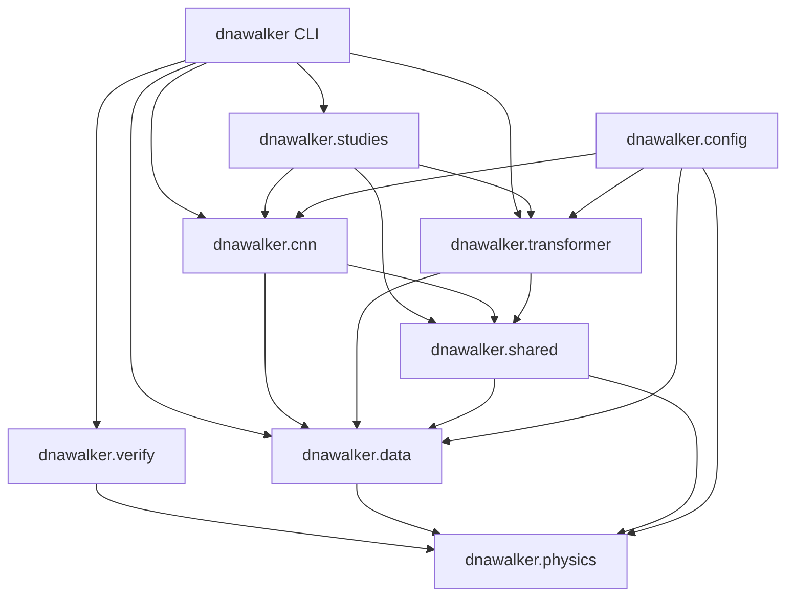
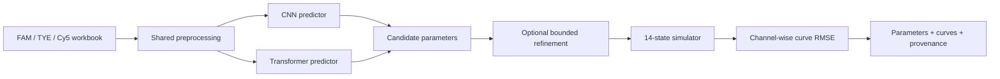
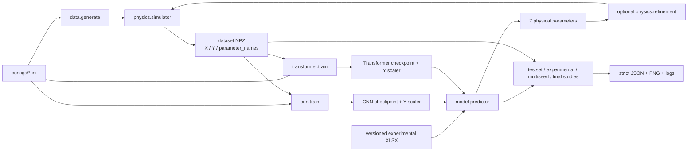
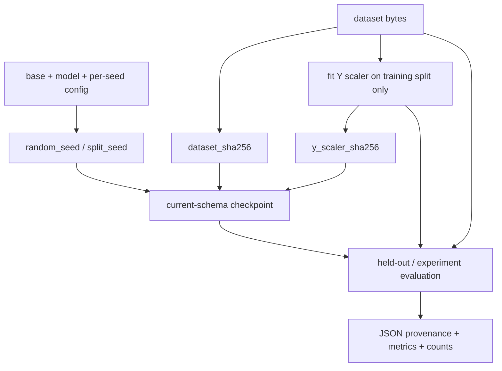

# Architecture

Last verified: **2026-07-30**.

The repository is an inverse-prediction application with one importable source
package. Its primary runtime maps three experimental fluorescence curves to
seven candidate physical parameters, optionally refines them through the
forward simulator, and reports curve agreement. Controlled studies validate
method selection but are not the primary runtime.

All active Python implementations live under `dnawalker/`. The current layout
is model-first: each model package owns its configuration adapter, tensor
adapter, architecture, trainer, predictor, prediction command, and evaluation
command. Shared scientific behavior is implemented once outside the models.

Structural work must not change simulator numerics, preprocessing, parameter
order, split membership, seeds, artifact identity, or scientific conclusions.
The final configuration move was checked against a saved pre-move baseline:
all 76 zero-argument getters produced identical values.

## Canonical dependency direction

Dependencies flow downward only:

1. **Unified command surface** — `dnawalker.cli` and `dnawalker.__main__`.
2. **Scientific orchestration** — `dnawalker.studies` and `dnawalker.verify`.
3. **Model workflows** — `dnawalker.cnn` and `dnawalker.transformer`.
4. **Shared domain services** — `dnawalker.shared`, `dnawalker.data`, and
   `dnawalker.tools`.
5. **Typed configuration** — `dnawalker.config` plus each model's `config.py`.
6. **Physics kernel** — `dnawalker.physics`.



`dnawalker.physics`, `dnawalker.config`, and low-level data helpers never
import a model package or study orchestrator. Model packages never import
study orchestration.

## Canonical package and repository layout

The package tree below is exhaustive for active Python modules. There are no
compatibility facades for the removed `models`, `experiments`, `inference`,
`support`, `core`, or `config.loader` namespaces.

```text
dnawalker/
├── __init__.py
├── __main__.py
├── cli.py
├── paths.py
├── config.py
├── verify.py
├── physics/
│   ├── __init__.py
│   ├── simulator.py
│   └── refinement.py
├── data/
│   ├── __init__.py
│   ├── experimental.py
│   ├── generate.py
│   ├── preprocessing.py
│   └── splits.py
├── cnn/
│   ├── __init__.py
│   └── {config,model,data,inference,train,predict,evaluate}.py
├── transformer/
│   ├── __init__.py
│   └── {config,model,data,inference,train,predict,evaluate}.py
├── shared/
│   ├── __init__.py
│   └── {artifacts,device,ensemble,evaluation,logging,parameters,
│        pipeline,seeding}.py
├── studies/
│   ├── __init__.py
│   ├── {protocol,identifiability,signal_analysis,learning_curve,
│   │    fit_robustness}.py
│   └── multiseed/
│       ├── __init__.py
│       └── {constants,runtime,evaluation,statistics,reporting,runner}.py
└── tools/
    ├── __init__.py
    └── {check_npz,mat_to_npz}.py
```

Configuration is centralized under `configs/`:

```text
configs/
├── common.ini
├── cnn.ini
├── transformer.ini
├── profiles/
│   └── smoke.ini
└── studies/
    └── nested_30k/
        ├── cnn_seed43.ini
        └── transformer_seed46.ini
```

Load order is `common.ini -> model.ini -> optional override`. Relative paths
are anchored to the primary config directory, not the caller's current working
directory. The complete path-by-path responsibility catalog is maintained in
[`FILE_INVENTORY.md`](FILE_INVENTORY.md).

## Primary inverse-prediction runtime



CNN and Transformer are alternative learned initializers for the same
physics-constrained application. The current single-branch default is the
validation-selected 24k Transformer plus physics refinement because it has the
lowest observed combined experimental-fit median. CNN remains a supported
complementary branch because it has the lower median on the generalization
workbook. The recommended future runtime refines both candidates and selects
by forward curve RMSE. Detailed evidence and claim boundaries are in
[`MODEL_COMPARISON.md`](MODEL_COMPARISON.md).

## Model capacity and execution cost

The formal model definitions and configuration layers currently instantiate:

| Model | Trainable parameters | Raw FP32 weights | Analytical forward MAC/sample |
|---|---:|---:|---:|
| `dnawalker.cnn.model.InverseCNN` | `4,381,319` | about `16.7 MiB` | about `38,067,168` |
| `dnawalker.transformer.model.DNAWalkerTransformer` | `3,243,271` | about `12.4 MiB` | about `780,223,360` |

Loading both branches for dual-initializer selection stores `7,624,590`
trainable values, about `29.1 MiB` as raw FP32 weights before runtime overhead.

Both counts are regression-tested against the canonical configuration. The
CNN's `16,384 -> 256` dense projection accounts for `4,194,304` weights, so it
has more parameters even though its arithmetic cost is lower. The Transformer
processes 78 patches with four temporal and two cross-channel attention blocks;
its analytical forward MAC count is about `20.5x` the CNN count.

MACs include convolution, linear projection, attention matrix multiplication,
and feed-forward multiplication. They exclude normalization, activation,
pooling, softmax, memory traffic, backward propagation, and device-specific
kernels. They are architecture estimates rather than measured latency. The
repository retains no same-device, current-lineage wall-clock benchmark that
would support a numerical training- or inference-speed ratio.

The training configurations also encode different operational budgets:
CNN uses batch size 256, an epoch cap of 2,000, and early-stopping patience
200; Transformer uses batch size 64, an epoch cap of 300, and patience 40.
These settings affect scheduling and memory use but cannot be converted into
elapsed time. In the complete application, repeated forward-simulator calls
during multi-start Powell refinement normally dominate both neural-network
forwards.

## Training, validation, and artifact flow



The active lifecycle has six distinct ownership classes:

| Class | Canonical location | Contract |
|---|---|---|
| Source and tests | `dnawalker/`, `tests/`, `scripts/` | Versioned implementation and gates |
| Configuration and input contract | `configs/`, `data/experimental/README.md` | Versioned run definitions and expected external-input identities |
| Large artifacts | `artifacts/datasets/`, `artifacts/models/`, `artifacts/releases/`, `artifacts/studies/` | Generated or externally restored; identity is SHA-256 |
| Run outputs | `results/` | Regenerable JSON, figures, predictions, and logs |
| Public evidence | `docs/evidence/` | Path-sanitized final JSON/PNG and checksums |
| Historical records | `docs/PROJECT_HISTORY.md`, `docs/audit/`, Git history | Provenance only; never imported at runtime |

Generated-file ownership is deterministic:

- dataset writers default to `artifacts/datasets/`; trainers and scaler writers
  use their configured model directory under `artifacts/`;
- CNN and Transformer prediction commands default to separate
  `results/predictions/<model>/` namespaces and accept an explicit `--out`;
- forward verification mirrors any prediction run subdirectory into
  `results/evaluation/<model>/`; inputs outside the canonical prediction tree
  use `results/evaluation/verification/`;
- model evaluations stay under `results/evaluation/<model>/`, cross-model
  summaries use `results/evaluation/comparisons/`, and validation studies use
  their dedicated `results/validation/` or `results/learning_curve/` roots;
- explicit CLI output paths are intentionally caller-owned and are never
  silently redirected.

Caches and local environments (`.venv/`, `.pytest_cache/`, `.hypothesis/`,
`__pycache__/`, `build/`) are not part of the architecture and must not be
committed.

## Retraining lineage

A formal training run is a lineage, not just a checkpoint filename:



`split_seed` fixes membership across architectures and model seeds;
`random_seed` changes model stochasticity. A model/scaler pair is valid only
for the dataset hash and ordered parameter names recorded in its checkpoint.
Changing generation, cleaning, parameter order, ranges, or split logic creates
a new lineage and requires retraining plus downstream reruns.

## Execution contract

There is no compatibility layer. Python code imports `dnawalker.*` directly.
The package exposes one `dnawalker` console script and the equivalent
`python -m dnawalker` module entry. Dispatch is lazy, so top-level help does
not import PyTorch or a model package.

Supported command forms:

```bash
python -m dnawalker data generate --help
python -m dnawalker cnn train --help
python -m dnawalker cnn predict --help
python -m dnawalker cnn evaluate --help
python -m dnawalker transformer train --help
python -m dnawalker study multiseed --help
python -m dnawalker study learning-curve --help
```

For a user-supplied workbook, both prediction leaves accept `--exp FILE`.
`scripts/run_application.sh` is the one-command wrapper around the
validation-selected 24k model configurations, common ensemble/refinement
settings, and forward verification. Its default is Transformer; `--model cnn`
selects the lower-compute branch and `--model both` runs both sequentially.
This is distinct from `scripts/run_smoke_test.sh`, which trains tiny temporary
models only to verify plumbing.

After an editable install, replace `python -m dnawalker` with `dnawalker`.
A non-editable wheel intentionally does not embed the repository's large
datasets/models; run it from the checkout or set
`DNAWALKER_PROJECT_ROOT=/absolute/path/to/checkout` so `dnawalker.paths` can
locate `configs/`, `data/`, `artifacts/`, and `results/`. Python code imports the
implementation directly:

Missing optional `[PATHS]` entries also fall back to these discovered
repository roots, rather than to the directory of an arbitrary custom INI.

```python
from dnawalker.physics import simulator
from dnawalker.config import Config
from dnawalker.data.preprocessing import normalize_per_sample
from dnawalker.shared.parameters import load_npz_dataset
```

## Stable interfaces

- `dnawalker.physics.simulator.run_simulation(params)` is the forward-model boundary.
  `get_call_count()` and `reset_call_count()` are process-local instrumentation.
- Predictor adapters expose `predict(curves)` and `get_param_names()`.
- `dnawalker.shared.parameters` owns canonical parameter ordering and text/NPZ
  metadata conversion.
- `dnawalker.data.preprocessing.normalize_per_sample` is the only input
  normalization implementation.
- `dnawalker.studies.protocol.write_json` is the strict validation-metrics
  writer.
- `dnawalker.config.Config.get_split_seed()` controls dataset
  membership; `get_random_seed()` controls model stochasticity.
- `dnawalker.shared.evaluation.run_evaluation` owns architecture-independent
  held-out accounting and provenance checks.
- `dnawalker.data.splits.load_explicit_split` owns dataset-bound manifest
  validation for activity-stratified nested experiments.

## Shared prediction and evaluation workflows

`dnawalker.shared.pipeline` contains only behavior proven equivalent across
architectures:

- `run_prediction_refinement`: ensemble prediction, parameter mapping, physics
  refinement, multi-start selection, reporting, and parameter-file writing.
- `evaluate_refined_dataset`: one experimental dataset's prediction,
  optional refinement, RMSE accounting, and plot inputs.

CNN and Transformer adapters inject their predictor, configuration, loader,
plotting, NumPy, and monkeypatchable numerical dependencies. Architecture-
specific `predict.py` behavior remains separate where contracts differ.
Held-out test evaluation uses `dnawalker.shared.evaluation` and is not
duplicated in `pipeline.py`.

## Data-split contract

Dataset membership and model randomness are independent:

- `split_seed` is fixed for train/validation/test membership and is shared by
  every architecture and model seed in a comparison.
- `random_seed` controls initialization, shuffling, dropout, and other model
  stochasticity.
- Evaluation recreates the training cleaning mask before splitting, preventing
  row removal from shifting held-out membership.
- An optional explicit split requires both `split_manifest_file` and
  `train_subset_size`. The manifest binds exact dataset bytes, sample count,
  split seed, disjoint validation/test rows, and named nested training rows.
- Explicit validation/test membership is unchanged across architectures,
  model seeds, and training sizes; selected rows must all survive the normal
  training cleanup mask.

Changing cleaning, sampling, parameter order, or split logic creates a new
experiment version and requires retraining. In the reviewed 10,000-sample
artifact, both architectures and model seeds 42–46 select the same 1,000 test
members with zero train/test intersection when `split_seed=42`.

## Multi-seed experiment

`dnawalker.studies.multiseed.runner` is the canonical orchestrator. Pure
responsibilities remain separated:

- `runtime.py`: model run specifications and checkpoint provenance.
- `evaluation.py`: validated metric and sample-accounting outcomes.
- `constants.py`: result schema and model names.
- `statistics.py`: aggregation over successful seed metrics.
- `reporting.py`: part validation, merging, and plotting.
- `runner.py`: training/evaluation sequencing and CLI.

Every attempted evaluation partitions the full test set into valid,
invalid-simulation, and catastrophic/extreme counts. Training or artifact
failure uses null counts to distinguish “not evaluated” from “evaluated with
zero valid samples.”

For nested learning curves, `dnawalker.studies.learning_curve` prepares one
activity-stratified manifest, delegates each model/size/seed run to the same
multi-seed orchestrator, strictly merges model parts, computes paired
Transformer-minus-CNN statistics, and writes a retained-parameter distribution
audit. Candidate rows originate from LHS, but the audit deliberately
distinguishes candidate-space stratification from the parameter marginals left
after physical validity filtering and activity quotas.

The learning-curve CLI keeps its two writable roots explicit:
`--artifacts-dir` owns the split manifest plus
`models/train_<size>/{cnn,transformer}/`, while `--results-dir` owns part JSON,
overrides, logs, merged comparisons, and the final JSON/PNG/Markdown summary.
No checkpoint or scaler is written below the result root.

The locked 30k grid completed 30/30 Apple MPS runs. Transformer-minus-CNN mean
differences contract from `+0.00412001` at 8k to `+0.00005871` at 24k. The
24k point estimate is a near-tie, but its five-seed 95% interval
`[-0.00225976,+0.00237718]` is wider than the predeclared `+/-0.001`
equivalence region, so all three formal decisions remain inconclusive. Ten 8k
numeric rows were restored from the append-only session log; the five original
8k Transformer checkpoint hashes are unavailable and those binaries are not
independently verifiable.

Run `retrain-3a5a494-ds557506e93079` completed CNN and Transformer seeds 42–46
against one fixed split. The strict merge reports 5/5 successful seeds for each
architecture. Its nearly equal means do not establish a preferred architecture;
Transformer also has 11 invalid/extreme outcomes that must remain visible.

The final experimental-fit study selects one 24k checkpoint per architecture by
minimum validation MSE across seeds 42-46, then reruns identical Powell
refinement with RNG seeds 0-4. Model-specific JSON/PNG stay under their CNN or
Transformer result directory; only the aggregate stability report belongs in
`results/evaluation/comparisons/`. This experiment measures optimizer-start
sensitivity and cannot replace a model-seed architecture comparison.

## Artifact and release boundary

Source, tests, configuration, documentation, audit records, curated public
evidence, and the validation-selected inference bundle under
`artifacts/application/` are versioned. Experimental workbooks, datasets,
non-selected checkpoints/scalers, complete generated metrics, plots, and logs
remain external or local. Publication rules are documented in
[`PUBLICATION.md`](PUBLICATION.md), while artifact identity is documented in
[`ARTIFACTS.md`](ARTIFACTS.md).

Current-schema checkpoints contain `model_state`, positive `epoch`, finite
`val_mse`, ordered `param_names`, `model_seed`, `split_seed`,
`dataset_sha256`, and `y_scaler_sha256`. Predictors verify the paired scaler;
held-out evaluation verifies the dataset and records actual artifact hashes.
Legacy checkpoints remain loadable only for compatibility diagnostics.

Checkpoints trained from an explicit manifest additionally contain
`split_manifest_sha256` and `train_subset_size`. Predictors reject those
checkpoints unless configuration supplies the matching manifest bytes and
subset size; evaluation records both configured and checkpoint values.

The selected application configs resolve both model pairs and the required
manifest from `artifacts/application/`. Prediction does not read the training
dataset. Held-out evaluation and retraining still require the external 30k
dataset bound by the checkpoint hash.

The reviewed legacy dataset remains frozen. The selected current release
dataset is the deterministic hardened seed-42 artifact with SHA-256
`557506e93079d1e5158aa30db7fd4a555234bb751e46049639b1fc827dca9b68`.
Corrected replenishment/quota behavior creates a new dataset version even with
the same seed. SHA-256, not a filename, defines dataset identity.

## Device boundary

Checkpoint tensors are loaded with explicit `map_location`. Transformer
inference is batch-bounded; a single 1,000-sample Apple MPS batch is not an
accepted execution path. Stored curves are `float32`, and CNN inference casts
before shared normalization to match training arithmetic.

Artifact identity requires exact SHA-256. Floating-point evaluation uses a
declared tolerance across CPU, MPS, and CUDA. Local CPU/MPS reorganization
checks are documented in [`TEST_CHECKLIST.md`](TEST_CHECKLIST.md); Linux/CUDA
release validation remains separate.

## Change rules

- Structural work must not alter physics, preprocessing, parameter order,
  random-number sequencing, split membership, metric definitions, or output
  schemas.
- Shared behavior is implemented once only when architecture contracts are
  genuinely equivalent.
- `dnawalker/` is the single Python source of truth; no legacy import or script
  compatibility layer is reintroduced.
- Withdrawn experiment and MATLAB sources remain recoverable from Git history;
  only the compact historical explanation and audit outputs stay in the
  release tree.
- A numerical difference discovered during a refactor stops the structural
  change and is handled as a separate scientific change.
