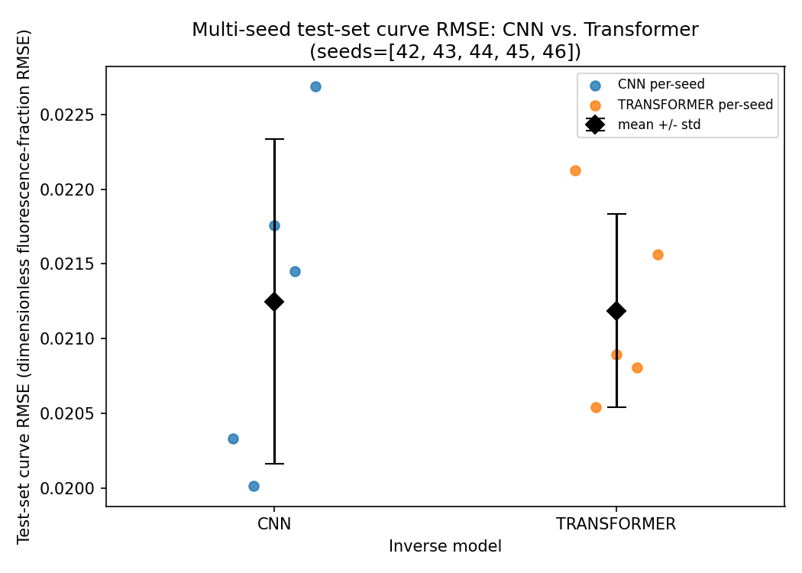
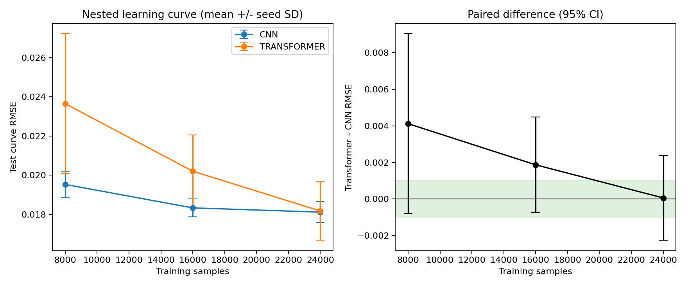
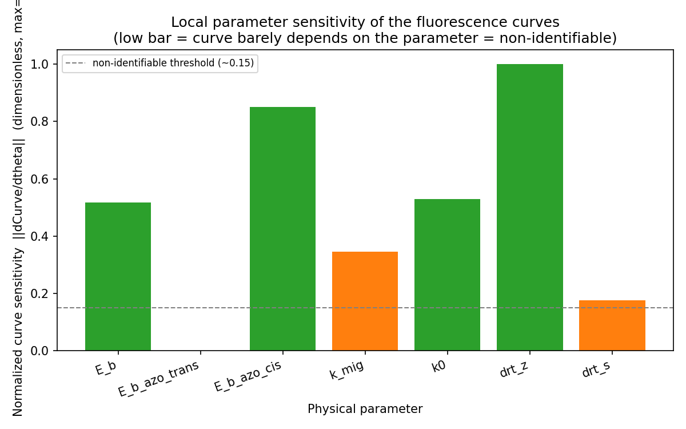

# Model Comparison and Application Selection

Last synchronized: **2026-07-30**.

## Purpose

The project is an inverse-prediction application, not a model-ranking
benchmark. It proposes two learned inverse methods:

| Method | Learned representation | Application role |
|---|---|---|
| CNN | Local and multiscale temporal waveform features | Fast seven-parameter initializer |
| Transformer | Patched temporal context and cross-channel attention | Fast seven-parameter initializer |

Both methods map three fluorescence curves to seven bounded physical
parameters. Both can be followed by the same test-time ensemble, bounded
multi-start physics refinement, and forward verification. The comparisons in
this document answer a practical question: **which initializer or combination
of initializers should the application use?**

This document holds the detailed comparison so that the root README can remain
focused on the application workflow.

## Application Decision

The current evidence supports three distinct statements:

1. **Both methods are usable.** CNN and Transformer both produce
   curve-consistent parameter candidates and both improve as retained training
   volume increases.
2. **Neither direct model is universally superior.** The controlled 10k and
   nested 30k held-out comparisons do not establish a stable architecture
   advantage.
3. **Transformer plus physics refinement is the current single-branch
   default.** It has the lowest observed combined median RMSE across the two
   experimental workbooks, `0.013767`, compared with `0.016303` for CNN.
4. **CNN is the lower-compute network.** Under the formal configurations its
   analytical forward cost is about `38.1M` MAC per sample, versus `780.2M`
   for Transformer. This is a complexity result, not a measured latency
   result.

The third statement is an application choice under the available evidence. It
is not a universal architecture claim. CNN has the lower median on the
generalization workbook, so the recommended future application is a
dual-initializer system that refines both candidates and selects by forward
curve RMSE.

## Relation to Earlier README Recommendations

An early README recommended CNN using older held-out and experimental-fit
numbers. That recommendation was later withdrawn because the associated
checkpoints predated the current provenance schema: they did not bind model
seed, split seed, dataset, scaler, and result JSON into one verifiable lineage.
Some early multi-seed work also varied split membership with model randomness.

Those historical numbers remain useful for understanding project development,
but they cannot select the current application branch. Repository
reorganization did not reverse them. The current recommendation comes from the
current-schema 30k lineage, validation-only checkpoint selection, fixed split
membership, and the five-refinement-seed experimental evaluation documented
below.

## Architecture Size and Runtime Cost

The following values are tied to the formal architecture settings in
`configs/common.ini`, `configs/cnn.ini`, and `configs/transformer.ini`.
Parameter counts include every trainable tensor. Raw FP32 weight storage is
`parameter_count x 4 bytes` and excludes checkpoint metadata, buffers, scaler
files, gradients, optimizer state, and activations.

| Property | CNN | Transformer |
|---|---:|---:|
| Trainable parameters | **`4,381,319`** | **`3,243,271`** |
| Compact count | `4.38M` | `3.24M` |
| Raw FP32 weights | about `16.7 MiB` | about `12.4 MiB` |
| Input representation | `(3, 7801)`, flattened at the loader boundary | `(3, 7801)` |
| Effective patch count | not applicable | `78` (`patch=100`, `stride=100`) |
| Analytical forward MAC per sample | about **`38,067,168`** | about **`780,223,360`** |
| Transformer/CNN MAC ratio | `1.0x` | about **`20.5x`** |
| Configured batch size | `256` | `64` |
| Configured epoch cap | `2000` | `300` |
| Early-stopping patience | `200` | `40` |
| Current 10k selected best-epoch range | `243-268` | `189-227` |

The dual-initializer application loads `7,624,590` trainable values in total,
equivalent to about `29.1 MiB` of raw FP32 weights before framework overhead.

The CNN has more parameters because its pooled feature map is flattened from
`256 x 64 = 16,384` values into a 256-unit dense layer. That layer alone has
`4,194,304` weights. The Transformer has fewer stored weights, but applies
four temporal-attention blocks to 78 patches in each channel and two
cross-channel-attention blocks. Parameter count therefore must not be used as
a proxy for arithmetic cost.

The MAC estimate counts conventional multiply-accumulate operations in
convolutions, dense projections, attention matrix products, and feed-forward
layers. It excludes normalization, activation, pooling, softmax, memory
movement, backward propagation, and implementation-specific kernels. It is an
analytical comparison, not a profiler or wall-clock measurement.

### Training speed and cost

No comparable current-lineage wall-clock training logs survive for both
architectures under the same device, software environment, timing boundary,
and workload. The historical speed and warm-start studies were withdrawn
because their checkpoints did not satisfy the final provenance contract.
Consequently:

- CNN is structurally expected to require less arithmetic per sample and to
  train faster under a controlled implementation;
- Transformer uses a smaller configured batch and a shorter epoch cap, but
  neither setting establishes elapsed-time superiority;
- selected best epoch is a checkpoint-selection index, not a duration;
- no empirical statement such as "CNN trains N times faster" is supported by
  the current artifacts.

### Inference speed and end-to-end application cost

For raw neural-network prediction, the `20.5x` per-sample MAC ratio supports
the expectation that CNN is the faster and lower-energy initializer on
comparable hardware. Actual latency can differ because batching, kernel
fusion, memory traffic, MPS/CUDA implementation, and the CNN's MPS-compatible
pooling path are not represented by MACs.

For the recommended refined application, network inference is only the first
step. An ensemble prediction is followed by bounded multi-start Powell
optimization, which repeatedly calls the 14-state physical simulator. Those
simulations normally dominate end-to-end runtime, so a large raw-network
latency difference may have a much smaller effect on total prediction time.
No current comparable end-to-end wall-clock records are retained.

A future empirical benchmark must use the same machine and software stack,
fixed precision, identical input samples and batch sizes, explicit device
synchronization, warmup iterations, repeated timed iterations, and separate
reporting for raw network prediction, ensemble prediction, refinement, and
the complete workflow. Until that benchmark exists, only the analytical cost
comparison above is defensible.

## Metrics and Selection Rules

### Direct held-out prediction

For each held-out synthetic curve:

1. predict seven parameters without physics refinement;
2. run the predicted parameters through the shared 14-state simulator;
3. compute the mean RMSE across FAM, TYE, and Cy5;
4. account for every attempted row as valid, invalid, or extreme.

This metric tests the learned inverse model itself. It does not include
optimizer behavior.

### Experimental application fit

For each experimental workbook:

1. preprocess the three observed curves;
2. obtain an ensemble model prediction;
3. use bounded multi-start Powell refinement;
4. forward-simulate the refined parameters;
5. report channel-wise and three-channel mean RMSE.

This metric tests the complete application workflow. It combines learned
initialization and physics refinement.

### Why the two metrics are not interchangeable

Direct held-out evaluation is appropriate for controlled architecture
comparison because synthetic parameter labels and fixed test membership are
available. Experimental evaluation is appropriate for application selection
because the observed curves are available but unique ground-truth microscopic
parameters are not. A model can therefore tie on direct held-out prediction
yet produce a better optimizer starting point for one experimental trace.

## Current 10k Five-Seed Comparison

The hardened 10,000-row seed-42 dataset has SHA-256:

```text
557506e93079d1e5158aa30db7fd4a555234bb751e46049639b1fc827dca9b68
```

CNN and Transformer use model seeds 42-46 and the same fixed
`split_seed=42`, so test membership is identical.

| Architecture | Curve RMSE, mean +/- sample SD | Valid / invalid / extreme |
|---|---:|---:|
| CNN | `0.02124865 +/- 0.00108720` | `5000 / 0 / 0` |
| Transformer | `0.02118662 +/- 0.00064572` | `4989 / 8 / 3` |

The paired Transformer-minus-CNN mean is `-0.00006203`. The exploratory paired
test gives `p=0.915`, and the 95% confidence interval crosses zero. The point
estimates are effectively tied at the resolution of this study, while the
Transformer invalid/extreme outcomes remain part of the result.



Machine-readable record:
[`current_10k_manifest.json`](evidence/current_10k_manifest.json).

## Fixed 30k Nested Learning Curve

One 30,000-row master dataset and one immutable split manifest define:

- 3,000 validation rows;
- 3,000 test rows;
- strictly nested 8k, 16k, and 24k training subsets;
- five model seeds, 42-46, for each architecture and size.

The complete grid contains `2 architectures x 3 sizes x 5 seeds = 30/30`
successful Apple MPS runs. The predeclared contrast is Transformer minus CNN,
with a practical-equivalence region of `[-0.001, +0.001]`.

| Train rows | CNN mean +/- SD | Transformer mean +/- SD | Transformer - CNN, 95% CI | Decision |
|---:|---:|---:|---:|---|
| 8,000 | `0.01953252 +/- 0.00066847` | `0.02365253 +/- 0.00357211` | `+0.00412001 [-0.00080583, +0.00904584]` | Inconclusive |
| 16,000 | `0.01833638 +/- 0.00046472` | `0.02020585 +/- 0.00185304` | `+0.00186948 [-0.00074115, +0.00448010]` | Inconclusive |
| 24,000 | `0.01811960 +/- 0.00053594` | `0.01817831 +/- 0.00149517` | `+0.00005871 [-0.00225976, +0.00237718]` | Inconclusive |

Aggregate sample accounting:

| Train rows | CNN valid / invalid / extreme | Transformer valid / invalid / extreme |
|---:|---:|---:|
| 8,000 | `14998 / 2 / 0` | `14978 / 15 / 7` |
| 16,000 | `14994 / 0 / 6` | `14986 / 9 / 5` |
| 24,000 | `14989 / 3 / 8` | `14980 / 11 / 9` |

Both methods improve with more retained training data. The observed gap
contracts from `+0.00412001` at 8k to `+0.00005871` at 24k. At 24k the means
are a near-tie, but the interval is wider than the locked equivalence region.
The correct decision is unresolved seed uncertainty, not proven equivalence.



Artifact identities:

| Input | SHA-256 |
|---|---|
| 30k dataset | `f19f0ae0c63a104ea23c96cc83ce5ce1e0d22fd22c5e1a498dfe6ff53418de06` |
| Split manifest | `a8bd1b7ae578bf48efc5ffc69e4372a432be132963be0ae142f3bffe5c88acd0` |

The complete locked design, retained-distribution audit, recovery caveat, and
decision rule are in
[`LEARNING_CURVE_PROTOCOL.md`](LEARNING_CURVE_PROTOCOL.md). The sanitized
machine-readable result is
[`nested_learning_curve.json`](evidence/nested_learning_curve.json).

## Experimental Inverse-Prediction Results

### Checkpoint selection

One 24k checkpoint per method was selected **only by minimum validation MSE
across model seeds 42-46**, before experimental-fit RMSE was inspected.

| Architecture | Selected checkpoint | Validation MSE |
|---|---|---:|
| CNN | 24k seed 43 | `0.02106434` |
| Transformer | 24k seed 46 | `0.02101733` |

Both checkpoints use:

- ensemble size 20;
- ensemble noise standard deviation 0.005;
- Powell refinement;
- 8 starts;
- 500 iterations;
- refinement RNG seeds 0-4;
- the same two experimental workbooks.

### Aggregate application result

| Application branch | Original median (range) | Generalization median (range) | Combined median (range) |
|---|---:|---:|---:|
| CNN + physics refinement | `0.016290 (0.007779-0.020323)` | **`0.016038 (0.015956-0.033571)`** | `0.016303 (0.016082-0.020675)` |
| Transformer + physics refinement | **`0.007806 (0.007796-0.008220)`** | `0.019721 (0.016087-0.024852)` | **`0.013767 (0.011946-0.016328)`** |

Transformer has the best observed combined median and a substantially lower
median on the original workbook. Its combined median is descriptively about
15.6% lower than CNN's. CNN has the lower median on the generalization
workbook. This reversal is why the application should preserve both candidate
generators; the descriptive percentage is not a universal superiority claim.

### Curve-level results

The following English figures show refinement seed 0. Each contains FAM, TYE,
and Cy5 for the original and generalization workbooks. The aggregate table
above covers refinement seeds 0-4.


### Refinement robustness


The refinement-seed study measures sensitivity to non-convex optimizer starts
for one validation-selected checkpoint per architecture. It is not a
five-model-seed architecture test and does not override the direct held-out
comparison.

Machine-readable record:
[`fit_robustness.json`](evidence/fit_robustness.json).

## Identifiability and Output Interpretation

At the documented reference point, the Fisher information matrix is severely
ill-conditioned:

| Diagnostic | Result | Application interpretation |
|---|---:|---|
| FIM condition number | approximately `1.3e15` | Small curve changes can permit large parameter changes |
| Eigenvalue range | about `1e-11` to `1e4` | Local information spans about 15 orders of magnitude |
| Least-identifiable direction | dominated by `E_b_azo_trans` | This parameter direction has near-zero local response |
| Sharpest profile valley | `k0` | Strongest conditional constraint in the recorded profile |



Low curve RMSE therefore supports a curve-consistent candidate solution, not
unique microscopic ground truth. An application should return the seven
parameters together with:

- fitted curves;
- per-channel and mean RMSE;
- checkpoint, scaler, dataset, and configuration provenance;
- ensemble and refinement-seed spread;
- alternative low-RMSE candidates when available.

Machine-readable record:
[`identifiability_metrics.json`](evidence/identifiability_metrics.json).

## Recommended Future Application

The next application feature should automate a dual-initializer selection:

```text
experimental curves
        |
        +----------------------+
        |                      |
        v                      v
  CNN ensemble          Transformer ensemble
        |                      |
        v                      v
  physics refinement    physics refinement
        |                      |
        +----------+-----------+
                   |
                   v
       forward-RMSE comparison
                   |
                   v
 selected candidate + alternative + uncertainty
```

Selection by forward RMSE is possible at inference time because the
experimental curves are observed. It avoids assuming that the same learned
initializer is best for every trace. The current CLI already supports both
branches separately. `scripts/run_application.sh --model both` now launches
both selected branches and their forward verification in one command, while
automatic machine-readable winner selection and structured uncertainty output
remain future application work.

Prospective validation should then add genuinely independent experimental
workbooks. Additional ordinary training on the same scoped comparison is not
the highest-value next step.

## Evidence Boundaries

- Legacy, current 10k, and nested 30k results belong to different
  dataset/checkpoint lineages. Only the nested 30k study isolates training
  volume within one lineage.
- Repository reorganization preserved reviewed hashes and numerical behavior;
  it did not reverse a controlled result.
- Candidate parameters use LHS before physical, signal, and activity-quota
  filtering. The retained 30k dataset is activity-balanced but its seven
  parameter marginals are not uniform.
- Five original 8k Transformer checkpoint binaries and hashes were not
  recoverable. Their numeric rows are explicitly marked as session-log
  evidence.
- Experimental-fit refinement seeds measure optimizer-start sensitivity, not
  model-seed architecture superiority.
- Two experimental workbooks are enough to motivate an application strategy,
  but not enough to prove universal external generalization.
- Historical recovery, warm-start, speed, and capacity-ablation outputs were
  not rerun with the selected current artifacts and are outside the final
  claim set.
- The exact parameter counts and analytical MAC estimates describe the formal
  architecture. They do not constitute measured training or inference
  latency.

## Evidence Map

| Question | Record |
|---|---|
| What is the application and how is it run? | [`../README.md`](../README.md) |
| What are the exact model sizes and defensible runtime claims? | This document, "Architecture Size and Runtime Cost" |
| What is the complete 30k protocol? | [`LEARNING_CURVE_PROTOCOL.md`](LEARNING_CURVE_PROTOCOL.md) |
| Which artifacts are trusted? | [`ARTIFACTS.md`](ARTIFACTS.md) |
| Where are the curated JSON and figures? | [`evidence/README.md`](evidence/README.md) |
| What engineering and scientific gates passed? | [`TEST_CHECKLIST.md`](TEST_CHECKLIST.md) |
| How should the result be published? | [`PUBLICATION.md`](PUBLICATION.md) |
